# 輪講まとめ：Uncovering Underexplored Runtime Behaviors in ROS2-Based Autonomous Systems

**論文情報**

- **著者**: Chenghao Fan, Lanshun Nie, Jiacheng Zhang, Kun Dai, Shenghan Gao, Jing Li
- **所属**: Harbin Institute of Technology / New Jersey Institute of Technology
- **掲載**: ACM Transactions on Internet of Things, 2025年10月
---

## 1. 研究の背景と動機

ROS2（Robot Operating System 2）は、自律走行車やモバイルロボティクスなど、安全性・性能が重要なドメインで広く使われるミドルウェアである。DDSの上に構築され、非同期通信（Publisher/Subscriber、Service、Action）やExecutorによるコールバックベースの実行を提供する。

**問題意識**: 既存のROS2向けタイミング解析やスケジューリング戦略は、実世界のアプリケーションでは成り立たない**単純化された仮定**に依存している。本研究は、理論モデルと実際のランタイム挙動の間のギャップを、実証的アプローチで明らかにする。

**貢献**: 4つのランタイム挙動の実証的発見、ros2_tracingツールのTF・Action対応拡張、そしてNavigation2ロボットシミュレーションおよびAutoware自律走行システムでの実験的検証の3点

---

## 2. ROS2の基礎知識（Background）

### 2.1 基本エンティティとExecutorスケジューリング

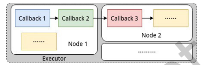

- **コールバック**: ROS2における最小の実行単位。タイマー・サブスクリプション・サービス・アクションなどで起動される。各コールバックは4つの状態を遷移する：idle（アイドル）、activated（活性化）、sampled（サンプル済み）、running（実行中）。
- **ノード**: 複数のコールバックを持つ。
- **Executor**: ノードのコールバックを管理・スケジューリング。シングルスレッド型とマルチスレッド型がある。
- **スケジューリング**: ノンプリエンプティブ（非割り込み）。ReadySet内の優先度は `タイマー > サブスクリプション > サービス > クライアント > アクション` の順。

### 2.2 ROS2 Actionエンティティ

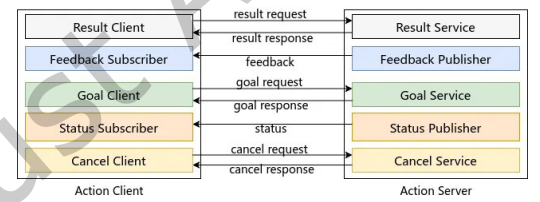

- 長時間動作するタスク（例: 経路計画）に使用される通信パターン。Action Client と Action Server で構成され、目標送信・フィードバック・結果取得・キャンセルをサポート。内部的にはPublisher/Subscriber/Client/Serviceを複合的に使用。
- 実行時にコールバックがGoal Clientを使用してAction Serverにゴールリクエストを送信することでActionをトリガする。
- Actionエンティティ内のコールバックスケジューリングは事前定義された優先度に従う。Action Client側では、コールバック優先度は（高から低の順に）：Feedback Subscriber、Status Subscriber、Goal Client、Result Client、Cancel Clientである。Action Server側では、優先度順序は：Goal Service、Cancel Service、Result Serviceである。

### 2.3 Cause-Effect Chain

- コールバック間のデータ・制御依存のChainで、センサ入力からアクチュエータ出力へのデータ伝播を表す。
- **ノード間通信**: DDS経由（Publisher-Subscriber、Client-Service、Action）。トリガチェーン。
- **ノード内通信**: DDS不要の内部バッファ経由（例: TFバッファ）データチェーン
- **タイミング評価の主要メトリクス**:
  - **応答時間（Response Time）**: Chainの最初のコールバック開始から最後のコールバック完了まで
  - **Maximum Reaction Time, MRT**: 外部イベント発生からアクチュエータに影響が出るまでの最大遅延。つまり「システムが外部の変化にどれだけ速く反応できるか」を表す。
  - **Maximum Data Age, MDA**: センサがイベントを検出してから、その影響がアクチュエータで消えるまでの最大期間。つまり「古いデータがどれだけ長くシステムに影響し続けるか」を表す。

　
 MRTとMDA 

MRTとMDAを、信号機の例で説明。

## MRT（Maximum Reaction Time）：「気づくまでの最大遅延」

交差点の信号が赤に変わった場面。

- 時刻 $t_0$：信号が赤に変わる（外部イベント発生）
- 時刻 $t_1$：ドライバーの目が信号を見る（センサが検出）
- 時刻 $t_2$：ブレーキが実際に効き始める（アクチュエータに反映）

**MRT = $t_2 - t_0$**、つまり「現実世界で何かが起きてから、ロボットが実際に反応するまでの最大時間」

## MDA（Maximum Data Age）：「古いデータの影響が残る最大期間」

同じ信号の例。

- 時刻 $t'_0$：センサが赤信号を検出
- 時刻 $t'_1$：その情報に基づいてブレーキ開始
- 時刻 $t'_2$：次の新しいセンサデータで制御が更新され、古い情報の影響が消える

**MDA = $t'_2 - t'_0$**、つまり「あるセンサデータがシステムの動作に影響し続ける最大期間」

## 両者の違いのポイント

| | MRT | MDA |
|---|---|---|
| 計測の起点 | イベントの**発生**時刻 | センサの**検出**時刻 |
| 計測の終点 | 最初に影響が**現れる**時刻 | 影響が**消える**時刻 |
| 意味 | 反応の速さ | データの古さ |

通常のFIFOアクセス（常に最新データを使う）では MRT = MDA になるが、TFバッファのように古いデータも参照する場合、MDAがMRTより大きくなりうる、というのが本論文の指摘。

### 2.4 TFライブラリ・Navigation2・ Behavior Tree

- **TF（Transform Library）**: 座標フレーム間の空間変換を管理。分散バッファ設計で各ノードがローカルバッファを保持。変換データへのアクセスを必要とする各ノードは、自身のローカルTFバッファを維持し、これはグローバルに自動的に同期される。ROS2では、このライブラリの更新版はTF2と呼ばれるが、一貫性のため、本論文の残りの部分では単にTFと呼ぶ。
- **Navigation2**: ROS2ベースのナビゲーションスタック。グローバルプランニング（静的マップ上の経路計算）とローカルプランニング（リアルタイム障害物回避）を提供する。典型的なアプリケーションでは、ユーザまたは自律タスクプランナーがマップ上の目標位置を指定し、Navigation2が自動的にグローバルプランを生成し、リアルタイムの障害物回避を実行し、ロボットを目標位置に向かって駆動する。
- **Behavior Tree（BT）**: 階層的な行動制御構造。Navigation2のタスク実行のデフォルトメカニズム。リーフノードは具体的なロボットのアクションや行動に対応し、コンポジットノードは制御フローロジックを定義する。固定周波数でtickされ、グローバルプランニング・ローカルプランニング・リカバリなどのモード遷移を管理する、Navigation2の各機能を「いつ、どの順番で実行するか」を決める制御構造。

---

## 3. 主要な発見（4つの実証的観察）

### 3.1 部分的Cause-Effect Chainの重要性

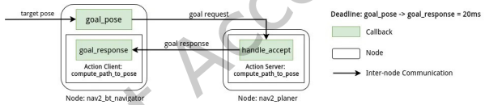

**既存の仮定**: タイミング解析はセンサからアクチュエータまでの**エンドツーエンド**Chainに焦点。これらのChainがリアルタイム制約を満たすことを確保することは、自律システムの安全性と応答性にとって疑いなく不可欠である。

**観察**: 実世界では、エンドツーエンドでない**部分的なCause-Effect Chain**も同様に重要であり、厳しいリアルタイム制約を持つ。部分Chainの開始コールバックは必ずしもタイマーコールバックではなく、アクチュエータまで延びない場合もある。

**具体例（Navigation2）**:
- `goal_pose`（目標位置受信）→ Action Server `compute_path_to_pose`（経路計算）→ `goal_response`（応答受信）の部分Chainに**20msのハードデッドライン**が存在。
- デッドラインを超過すると、**Recoveryメカニズム**が発動（コストマップクリア、スピン、バックアップ、待機など）。
- リカバリ発動は通常動作時に深刻な機能劣化（速度低下、振動的挙動）を引き起こす。このリカバリは連続で発動する。連続発動回数によって挙動が変わるため、一度リカバリに入るとシステムの挙動が予測不可能になる

**示唆**: リアルタイム解析の対象をエンドツーエンドChainだけでなく、部分Chainにも拡大する必要がある。部分Chainはセンサによる周期的トリガではなく散発的にトリガされるため、既存の周期的解析手法がそのまま適用できない。

### 3.2 Cause-Effect Chainの構造・タイミングの実行時変動

**既存の仮定**:最悪応答時間（WCRT）解析アプローチにおいて、Cause-Effect Chainは固定的な構造・ほぼ一定の実行時間を持つ。

**観察**: 実行時に、システムの状態に応じてChainの構造とタイミングが**動的に変化**する。

**構造の変動例（Navigation2）**:
Navigation2はナビゲーションを2つの主要なフェーズに分離する：

- グローバルプランニング起動時（ナビゲーションゴールの位置指定時）: LiDAR → nav2_amcl → nav2_planner → nav2_bt_navigator → nav2_controller → wheels（長いChain）
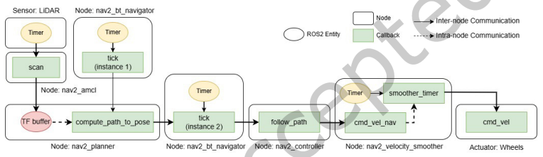
- 巡航状態時: LiDAR → nav2_amcl → nav2_controller → wheels（短いChain、Global Plannerをバイパス）
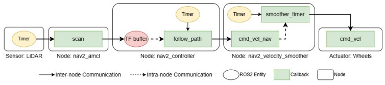
-  Behavior Treeのtickにより、1秒ごとにモード遷移が発生。

-最長の構造パス（すなわちグローバルプランニングを含むもの）を用いて全シナリオの最悪ケース挙動をモデル化すると、システムのランタイムの大部分において過度に悲観的なWCRTをもたらす。

**タイミングの変動例**:

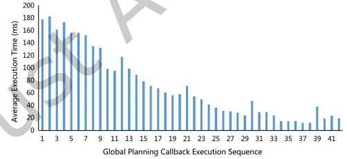
- TurtleBot3 Waffleロボットを使用したNavigation2のウェアハウスシナリオにおいて、Dijkstraベースのグローバルプランニングの実行時間は、目標から遠い時（約180ms）から近い時（約20ms）まで大きく変動。
- グローバルプランナーのコールバックを180msの保守的なWCETでモデル化すると、そのコールバックを含む全てのCause-Effect ChainのWCRTは、システム運用の大部分にわたって過度に悲観的になる。

**示唆**: 動的なチェーン構成と実行挙動のモデル化、オンラインモニタリングによる適応的スケジューリング、および状態依存的な変化に対応できる解析技法の開発が必要

### 3.3 非FIFO データアクセスパターン

MRT≠MDA

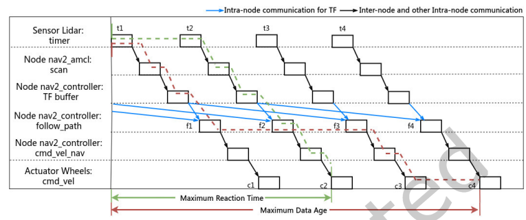

MRT=MDA

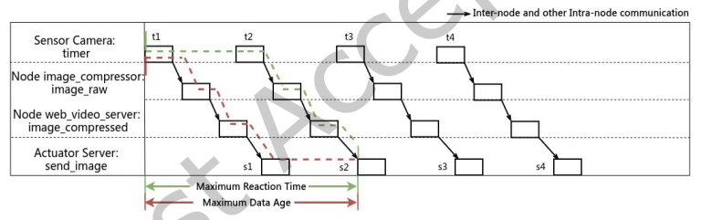

**既存の仮定**: データバッファまたはメッセージキューが、無限サイズまたはデータリフレッシュセマンティクスを組み込んだ有限サイズのいずれかで、FIFO順序で動作すると仮定。

**観察**: 実アプリケーションでは、機能的な整合性のため**意図的に非FIFO順序の古いデータに基づいて動作する**場合がある。

**具体例（Navigation2のTFバッファ）**:
- mapフレームはLiDARによって更新され、odomフレームはホイールオドメトリによって更新される。センサの更新レートの違いに加えて、Navigation2におけるAMCLの計算と更新により、LiDARからのデータ（mapフレーム用）は、TFバッファにおいてオドメトリデータ（odomフレーム用）より常に約1秒新しい。
- ローカルプランニング中、ロボットのポーズをodomフレームからmapフレームに変換する必要がある。更新頻度とタイムスタンプの違いにより、整合性の問題が生じる：最新の利用可能なオドメトリデータは、時間的に最新のLiDARデータより通常遅れている。このような変換における時間的整合性を維持するために、ローカルプランナーは最新のLiDARデータだけでなく、オドメトリのタイムスタンプに対応するLiDARデータも問い合わせる必要がある。
  - `map`フレーム（LiDAR由来）と`odom`フレーム（オドメトリ由来）の時間的整合性を保つため。この結果、**MRTとMDAが等しくならない**（FIFO前提では等しくなるが）。

**ROS2の有界キューによる影響**:

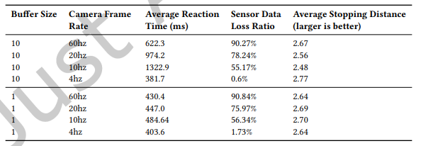

- デフォルトのメッセージキューサイズ（10）では、高頻度のPublisherに対して処理が追いつかない場合、古いデータを処理したりデータが欠落する。
- 実験（TurtleBot3 + YOLOv3 Tiny）: カメラ60Hz、バッファサイズ10で**約90%のセンサデータが喪失**し、YOLOv3は最大10フレーム前の古いデータを処理。バッファサイズ1では最新データが常に使用され、停止距離への悪影響が軽減。バッファオーバーフローが発生すると、反応時間と機能的性能の間の関係はより複雑で予測しにくくなる。

**示唆**: タイミング解析フレームワークを非FIFOデータアクセスに対応させること、コールバック内のデータ使用パターンを明示的に特定する手法の開発、および有界キューの最適サイズの解析的決定が必要である。

### 3.4 Executorが制御しない計算スレッドの存在

**既存の仮定**: 全ての計算はROS2 Executorの管理下にある。

**観察**: 実アプリケーションでは、多くの重要な計算がExecutor外のスレッドで実行される。ROS2エグゼキュータはノンプリエンプティブなので、重い計算をエグゼキュータ内で実行すると他の全コールバックがブロックされる。これを回避するため、開発者は重い計算をOS APIで生成した別スレッドにオフロードする。

**具体例**:
- **Navigation2のAction Server**: グローバルプランニングの長時間計算を`std::thread`で別スレッドに委任。Executorの非割り込みスケジューリングで他のコールバックをブロックしないため。
- **Costmap2DROSのmapUpdateLoop**: ノード初期化時に起動されるバックグラウンドスレッド。
- **AutowareのNDT Scan Matcher**: OpenMPによる並列スレッド実行。このモジュール内の多くの重要な関数は#pragma omp parallel forを使用して複数のOpenMPスレッドを並列実行のために生成する。

**問題点**: これらの非管理スレッドはCPUリソースをROS2管理下のコールバックと独立して競合し、ROS2管理下のコールバックとデータをやり取りするが、既存のスケジューリング解析では考慮されていない。また、ROS2メッセージや共有データ構造を介してChainに直接参加しているため、無視するとレイテンシの見積もりが不完全になる。

**示唆**: 非Executor制御スレッドをリアルタイム解析にファーストクラスのエンティティとして組み込む必要がある。具体的には、これらのスレッドのインタラクションパターン・CPU競合・状態依存的な活性化のモデル化、およびスレッド挙動をROS2ランタイムやエグゼキュータに公開するための標準的なインターフェースの開発。

---

## 4. トレーシングツールの拡張

既存の`ros2_tracing`（C. Bédard et al.）を拡張し、以下をサポート:

### 4.1 TFトレーシング

3つの新しいトレースポイントを導入:
- **`store_in_buffer`**: TFバッファへの変換メッセージ格納を記録。上流の部分Chainの末尾を特定。
- **`calculate_in_buffer`**: 格納されたメッセージの使用を記録。　下流の部分Chainの先頭を特定。
- **`interpolate_in_buffer`**: 2つのTFメッセージの補間を記録。下流の部分Chainの先頭を特定（補間の場合）。

→ ノード内通信（TFバッファ経由）のCause-Effect Chainを再構築可能に。

### 4.2 Actionトレーシング

- Client-Service通信の双方向追跡をサポート。
- 長時間計算スレッド用に`action_callback_start`/`action_callback_end`トレースポイントを追加。

### 4.3 トレーシングオーバーヘッド

追加トレースポイントのオーバーヘッドは平均**0.0012ms**（既存の0.003msより小さい）。最大48バイトのデータを書き込む。

---

## 5. 実験（シミュレーション環境での検証）

### 5.1 実験環境

- **シミュレータ**: Gazebo 11.10.2 + TurtleBot3 Waffle
- **2台のサーバ**: シミュレーション用とROS2アプリケーション用を分離（1000Mb/s Ethernet直結）
- ROS2アプリケーション用 : **ROS2 Humble**, Linuxカーネル6.8.2, PREEMPT_RTカーネル, Ubuntu 22.04.2, CPU周波数固定1.4GHz, コアアイソレーション, AMD Ryzen 5 5600G CPU, 16GB RAM
- シミュレーション用 ：ロボットモデルはTurtleBot3 Waffleであり、仮想RGBカメラは480×320の解像度で使用された。シミュレートされたカメラはBGR8形式でエンコードされた画像をストリーミングした。

### 5.2 スケジューリング構成

| 構成 | 特徴 |
|------|------|
| **Redundant** | 各コンポーネントに十分なリソース。最小限の干渉で全てのリアルタイム制約と応答性要件が満たされることを保証する。ROS2ノードは専用のエグゼキュータに割り当てられ、CFSスケジューリングを使用。|
| **Config 1** | 意図的なリソース競合シナリオ。nav2_amclとcv_detectionを同一Executor/コアに配置。れらのコールバックはROS2エグゼキュータのスケジューラを使用してスケジュールされ、ノンプリエンプティブに実行される。他の全ての設定は冗長構成に従う。 |
| **Config 2** | Config 1に対してエグゼキュータ間の競合とスレッド間のプリエンプションの両方を導入。nav2_plannerのAction Serverとcamera_img_recorderを同一コアに配置。プリエンプション導入。 |
| **Config 3** |  ROS2によって制御されないスレッドの調査シナリオ。グローバルプランニングの非管理スレッドとweb_video_serverを同一コアに配置。 |

　
 詳細 

- 構成1（Configuration 1）： 冗長構成を変更し、ROS2エグゼキュータスケジューリングのリアルタイム性能と機能的挙動への影響を研究するための意図的なリソース競合シナリオを導入する。具体的には、ロボットのローカリゼーションを処理するnav2_amclノードに焦点を当てる。そのコアコールバックであるscanは、scanトピックのLiDARデータをサブスクライブし、パーティクルフィルタベースのポーズ推定を実行する。ローカリゼーションにとって最も重要なタスクの一つである。この構成では、nav2_amclノードをコア5に再割り当てし、視覚入力に基づく物体追跡モジュールであるcv_detectionノードと計算リソースを共有させる。nav2_amclのscanコールバックとcv_detectionノードの両方を同じROS2エグゼキュータにバインドし、コア5で実行する。このセットアップでは、これらのコールバックはROS2エグゼキュータのスケジューラを使用してスケジュールされ、ノンプリエンプティブに実行される。重要なことに、他のエグゼキュータやスレッドはコア5に配置されない。他の全ての設定は冗長構成に従う。
- 構成2（Configuration 2）： 冗長構成から拡張し、エグゼキュータ間の競合とスレッド間のプリエンプションの両方を導入する。このセットアップでは、ROS2 Actionインターフェースを使用してグローバルプランニング機能を実装するnav2_plannerノードをコア間で分割する。具体的には、到着するプランニングゴールを処理するAction Serverコールバックをコア5に移動し、残りのコールバックと長時間実行プランニングスレッドはコア3に残す。さらに、カメラフレームを継続的にログするcamera_img_recorderノードもコア5に再割り当てする。camera_img_recorderとnav2_plannerからのAction Serverコールバックは同じROS2エグゼキュータにバインドされ、それ自体がコア5にピン留めされる。これにより2つのコールバック間に潜在的なエグゼキュータレベルのスケジューリング競合が生じる。一方、別スレッドのcv_detectionノードは、冗長構成では排他的アクセスで実行するよう設計されていたが、今度はコア5上の他のエグゼキュータスレッドとも競合する。スレッドレベルのプリエンプションの影響を予測可能に検証するため、camera_img_recorderとAction Serverコールバックをホストするエグゼキュータスレッドにリアルタイム優先度5を割り当て、これはcv_detectionより高い。他の全ての設定は冗長構成と同じである。
- 構成3（Configuration 3）： ROS2によって制御されないスレッドがCause-Effect Chainのタイミングに与える影響を調査するために設計された。冗長構成に基づき、このセットアップはnav2_plannerノード内のグローバルプランニングモジュール、具体的にはAction Serverによって生成されるがROS2エグゼキュータの制御外で実行される長時間実行プランニングスレッドの配置を変更する。このプランニングスレッドはコア5にピン留めされる。さらに、ネットワーク経由で圧縮カメラビデオをストリーミングするweb_video_serverノードもコア5に移動される。プランニングスレッドとは異なり、このノードはROS2エグゼキュータによって管理される。無関係な競合からの変動性を減らすため、以前コア5に位置していたcv_detectionノードは、最も使用率の低いコア4に再割り当てされる。したがって、コア5では長時間実行プランニングスレッドとweb_video_serverを管理するエグゼキュータスレッドの2つのスレッドのみがアクティブである。これらのスレッドにそれぞれ優先度5と3を割り当て、グローバルプランニングスレッドにより高い優先度を与える。

### 5.3 シナリオ1: 単一目標ナビゲーション + ビデオストリーミング
ロボットは搭載カメラからのビデオを同時にストリーミングしながら、位置(0,0)から(3.72, -8.62)への移動を指示される。

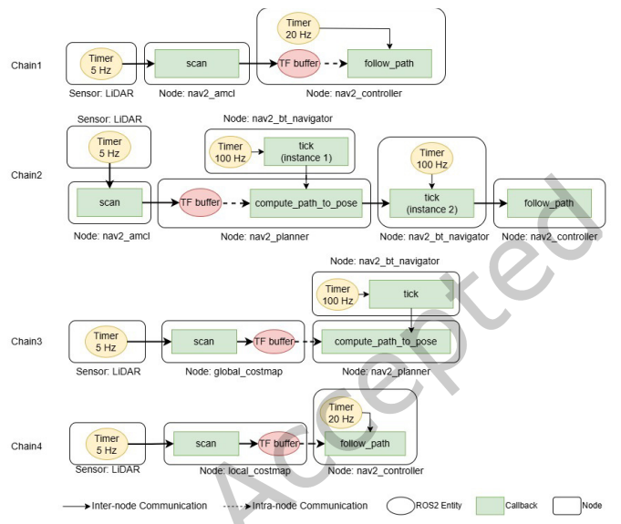

## 評価対象の5つのCause-Effect Chain
 
| Chain | 内容 | デッドライン |
|---|---|---|
| Chain 1 | LiDAR → nav2_amcl → TFバッファ → follow_path（ローカルプランニング） | 1.2秒 |
| Chain 2 | LiDAR → nav2_amcl → TFバッファ → compute_path_to_pose → follow_path | 3.846秒 |
| Chain 3 | LiDAR → global_costmap → TFバッファ → compute_path_to_pose | 3.846秒 |
| Chain 4 | LiDAR → local_costmap → TFバッファ → follow_path | 3.846秒 |
| Chain 5 | カメラ → image_compressor → web_video_server（ストリーミング） | 20ms |
 
## 主要な実験結果

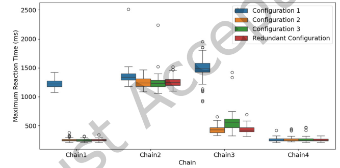
 
### 構成1の結果（非FIFOデータアクセスの影響を検証）
 
nav2_amclの`scan`コールバックとcv_detectionが同一エグゼキュータ（コア5）で競合。cv_detection実行中は`scan`がブロックされる。
 
**Chain 1のMRTが大幅増加：**
- `follow_path`は最新LiDARデータと古いLiDARデータの**両方**を使用（非FIFOアクセス）
- 最新データの取得が遅延するため、MRTが直接的に悪化
 
**Chain 2は影響なし：**
- `compute_path_to_pose`は約1秒前の古いデータ**のみ**使用
- `scan`が遅延しても、古いデータは既にTFバッファに存在するため影響を受けない
 
→ **同じLiDARデータの遅延が、非FIFOアクセスパターンの違いにより、Chain 1には影響するがChain 2には影響しない**。これは4.3節の観察を実証。
 
**Chain 3もデータ喪失（76/100）：**
- `global_costmap`の`scan`コールバック自体はcv_detectionと同じコアにないが、`compute_path_to_pose`がmapフレームへの障害物座標変換を必要とし、mapフレームはnav2_amclが更新
- nav2_amcl遅延により、mapフレームのタイムスタンプが古すぎて変換不能 → 障害物データ破棄
 
**Chain 4は安定：**
- odomフレームで動作し、AMCLではなくOdometryモジュールが更新 → 競合の影響なし
 
**デッドラインミスと機能的影響：**
 
| Chain | 構成 | デッドラインミス | センサデータ喪失 |
|---|---|---|---|
| Chain 1 | 構成1 | **59 / 100** | 52 / 100 |
| Chain 2 | 構成1 | 0 / 100 | 52 / 100 |
| Chain 3 | 構成1 | 0 / 100 | 76 / 100 |
| Chain 4 | 構成1 | 0 / 100 | 0 / 100 |
| Chain 1-4 | 構成2,3,冗長 | 0 / 100 | 0 / 100 |
 
**ミッション完了時間：**
 
| 構成 | 最大 (s) | 平均 (s) |
|---|---|---|
| 構成1 | 56.6 | **48.5** |
| 構成2 | 40.3 | 39.4 |
| 構成3 | 40.1 | 39.2 |
| 冗長構成 | 41.3 | 39.7 |
 
Chain 1の59%デッドライン超過 → ゼロ速度コマンド頻発 → 平均完了時間が**39s→48.5s**に悪化。
 
### 構成3の結果（非管理スレッドの影響を検証）

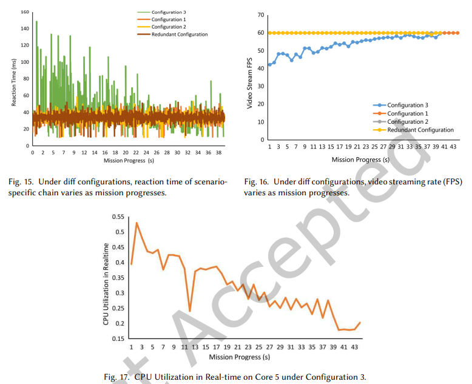
 
グローバルプランニングスレッド（Executor外・優先度5）がweb_video_server（優先度3）をプリエンプト。
 
- **Chain 5のReaction Time**: 140ms → 40msへ徐々に低下
  - ロボットがゴールに近づくとDijkstraの計算量が減少 → プランニングスレッドの実行時間が短縮 → プリエンプションの影響が減少
- **ビデオFPS**: ミッション進行に伴い改善（構成3のみ他より低いFPSで開始し、徐々に回復）
- **コア使用率は最悪ケースでも低い** → CPU使用率だけでは干渉を検出できない
 
## 検証された観察との対応
 
| 実験結果 | 対応する観察 |
|---|---|
| Chain 1のデッドラインミス → 機能劣化（完了時間悪化） | **4.1節**: 部分Chainのデッドラインの重要性 |
| Chain 1は影響あり、Chain 2は影響なし（同じデータ遅延なのに） | **4.3節**: 非FIFOデータアクセスの影響 |
| グローバルプランニングの実行時間がゴール接近に伴い動的に変化 | **4.2節**: タイミングの実行時変動 |
| 非管理スレッドがweb_video_serverに干渉（低CPU使用率でも） | **4.4節**: Executor外スレッドの影響 |

### 5.4 シナリオ2: 複数チェックポイントナビゲーション

## シナリオの概要
 
シナリオ1よりも現実に近い複雑なタスク。ロボットが8つのチェックポイントを順に巡回し、各チェックポイントでカメラ画像のディスク保存と棚のアイテム検出を同時に実行する。
 
ルート：(0, 0) → (6.43, 1.06) → (6.21, -1.13) → (6.29, -3.34) → (5.96, -8.65) → (3.81, -9.13) → (1.51, -9.08) → (-5.00, -7.37) → (0, 0)
 
## 評価対象のChain

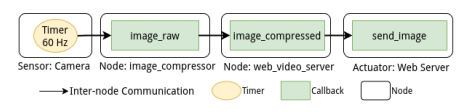
 
- **Chain 1〜4**：シナリオ1と同一（結果も同一）
- **シナリオ固有Chain**：`goal_pose`受信 → Action Server `handle_accept` → `goal_response`（デッドライン **20ms**）
 
## 主要な実験結果
 
### 構成2でデッドラインミスが発生する仕組み
 
1. ロボットがチェックポイントに到着する
2. `camera_img_recorder`が画像をディスクに書き込む（Subscriberコールバック）
3. 同時に`goal_pose`が次のナビゲーション目標を受信し、Cause-Effect Chainの構造が巡航状態→ グローバルプランニング起動に変化
4. `write_img_to_disk`（Subscriber）と`handle_accept`（Action）が同時にReadySetに入る
5. エグゼキュータの優先度ルール：**Subscriber > Action** のため、`handle_accept`が後回しにされる
6. 遅延により **20msデッドラインを超過**（100インスタンス中約5回）
7. デッドラインミス → **リカバリメカニズム発動**（スピン、ミッション中止の可能性）
 
### 応答時間の統計
 
| 構成 | 最大 (ms) | 平均 (ms) | 98パーセンタイル (ms) | 99パーセンタイル (ms) |
|---|---|---|---|---|
| 構成1 | 17.87 | 0.99 | 2.65 | 3.01 |
| **構成2** | **67.95** | 1.10 | 2.99 | **13.46** |
| 構成3 | 18.70 | 0.73 | 2.10 | 2.10 |
| 冗長構成 | 15.02 | 0.80 | 2.64 | 3.15 |
 
- 構成2の最大値（67.95ms）と99パーセンタイル（13.46ms）が突出して高い
- ただしチェックポイント到着時のみ発生するため、98パーセンタイルまでは他構成と同等
 
### ポイント：なぜチェックポイント到着時にだけ問題が起きるのか
 
通常の巡航中は`camera_img_recorder`と`handle_accept`が同時にReadySetに入ることはない。しかしチェックポイント到着という特定のタイミングで：
- 画像保存タスクが発生（`write_img_to_disk`がReadySetに入る）
- 同時に次の目標受信でグローバルプランニングが起動（`handle_accept`がReadySetに入る）
 
この2つが同時に起きることで、エグゼキュータの暗黙的優先度（Subscriber > Action）による競合が顕在化する。
 
## 検証された観察との対応
 
| 実験結果 | 対応する観察 |
|---|---|
| 20msデッドラインミス → リカバリ発動 | **4.1節**: 部分Chainのデッドラインの重要性 |
| チェックポイント到着でChain構造が図7→図6に変化し、新たな競合が発生 | **4.2節**: Cause-Effect Chainの構造の動的変動 |
| Subscriber > Actionの暗黙的優先度がhandle_acceptを遅延させる | ROS2エグゼキュータの優先度設計の問題 |
 
## 6. Autowareケーススタディ（Section 7）

### 6.1 環境

## 実験セットアップ

| 項目 | 詳細 |
|---|---|
| シミュレータ | CARLA 0.9.15（Town01マップ） |
| 自律走行スタック | Autoware.universe 2023.05 |
| ROS2バージョン | ROS2 Humble |
| タスク | 車線追従（ポイントツーポイント） |
| CUDA | 無効化（変動性削減のため） |
| 制御モジュール | simple_trajectory_follower（決定論的な軌道追従） |
| 接続 | 2台のマシンを1000Mb/s Ethernetで直結 |

## 3つの部分的Cause-Effect Chain

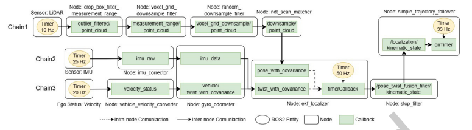

3つとも`ekf_localizer`でポーズ・速度情報がフュージョンされ、最終的に`simple_trajectory_follower`が制御コマンドを計算する。

| Chain | データソース | 経路 |
|---|---|---|
| Chain 1 | LiDAR | LiDAR → 点群フィルタリング（3段）→ ndt_scan_matcher → ekf_localizer → stop_filter → simple_trajectory_follower |
| Chain 2 | IMU | IMU → imu_corrector → gyro_odometer → ekf_localizer → stop_filter → simple_trajectory_follower |
| Chain 3 | Ego Status（速度） | Ego Status → vehicle_velocity_converter → gyro_odometer → ekf_localizer → stop_filter → simple_trajectory_follower |

全て **部分的Cause-Effect Chain** であり、ローカリゼーション→制御の部分に着目している。

## スケジューリング構成

### ベストエフォート構成
- ノードを名前空間ごとにグループ化し、コア0〜4に均等分散（コアあたり約7名前空間）
- CPU使用率の高い4ノードは専用コアに配置（pointcloud_containerはコア5）
- 全コアでCFS（Completely Fair Scheduler）を使用

### 構成1
- Chain 1〜3に関与する5ノードをコア5に集約
- pointcloud_containerと同一コア上で競合

| ノード | 優先度 (SCHED_FIFO) |
|---|---|
| gyro_odometer | 3（最高） |
| stop_filter | 2 |
| ekf_localizer, ndt_scan_matcher, simple_trajectory_follower | 1（最低） |
| pointcloud_container | 1（最低） |

→ pointcloud_containerとChain 1のノードが **同一優先度で競合**

### 構成2
- 構成1にimu_correctorを追加
- pointcloud_containerとgyro_odometer以外の全ノードの優先度を引き上げ

| ノード | 優先度 (SCHED_FIFO) |
|---|---|
| simple_trajectory_follower | 3（最高） |
| ekf_localizer, ndt_scan_matcher, stop_filter, gyro_odometer, imu_corrector | 2 |
| pointcloud_container | 1（最低） |

→ Chain 1〜3のノードがpointcloud_containerより **高い優先度** を持つ

## Maximum Reaction Timeの結果

| Chain | 構成1 最大(ms) | 構成2 最大(ms) | ベストエフォート 最大(ms) |
|---|---|---|---|
| Chain 1 (LiDAR) | **1691** | 567 | 370 |
| Chain 2 (IMU) | 2330 | 1995 | **3832** |
| Chain 3 (Ego) | 1718 | 1483 | **1873** |

### 構成1の分析
- **Chain 1のMRTが大幅増加（1691ms）**：pointcloud_containerが計算集約的で、Chain 1のノード（ndt_scan_matcher等）と同一優先度のため、ポーズメッセージが遅延
- **Chain 2, 3のMRTはベストエフォートより低い**：上流ノード（gyro_odometer等）が最高優先度またはコア5外で動作するため干渉が少ない。CFSの予測不可能な競合がなくなる効果もある

### 構成2の分析
- **Chain 1, 3**：全ノードがpointcloud_containerより高優先度 → MRTがベストエフォートと同等に改善
- **Chain 2**：全ノードが高優先度 → ベストエフォートを**上回る**性能（CFSの予測不可能な遅延が解消）

### ベストエフォートの分析
- Chain 1は最良（370ms）：pointcloud_containerが専用コアのため干渉なし
- **Chain 2, 3の最大MRTが構成1より高い場合がある**（3832ms, 1873ms）：CFSによる予測不可能な競合が最悪ケースで遅延を引き起こす

### 興味深い発見：CFSの落とし穴
ベストエフォート構成はリソースを均等に分散する「安全な」設計だが、CFSの非決定論的なスケジューリングにより最悪ケースでは構成1よりも悪い結果になりうる。これは、リアルタイム優先度を適切に設定することの重要性を示す。

## 機能的性能への影響

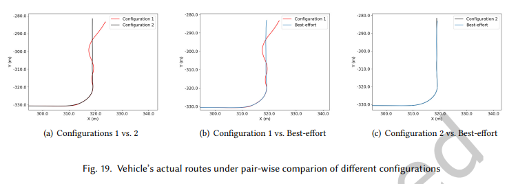

3つのサブプロット（ペアワイズ比較）：
- (a) 構成1 vs 構成2：構成1の軌道が大きく逸脱
- (b) 構成1 vs ベストエフォート：構成1の軌道が大きく逸脱
- (c) 構成2 vs ベストエフォート：両者ほぼ同一の軌道

### 車線維持精度
- **構成1**：Chain 1のMRT増大 → `simple_trajectory_follower`へのPose入力が遅延 → 制御精度劣化 → ターン後に **大きな車線逸脱**、不安定な軌道
- **構成2**：安定した軌道（ベストエフォートと同等）
- **ベストエフォート**：安定した軌道

→ 部分Chainのスケジューリングが自律走行の **車線維持** という機能的正確性に直接影響することを実証。

## 検証された観察

| 観察 | Autowareでの検証結果 |
|---|---|
| **4.1節：部分Chainの重要性** | Chain 1〜3は全て部分Chainだが、その性能が車線維持という機能的成果に直接影響 |
| **優先度調整の効果** | 構成1→構成2の優先度変更で、リアルタイムメトリクスと機能的性能の両方が大幅改善 |
| **部分Chainスケジューリングの必要性** | 部分Chainを明示的に考慮したスケジューリングと解析が、自律走行の安全性に不可欠 |
---

## 7. 結論と今後の方向性

### 主要貢献

1. **4つの実証的観察**: 部分Chainの重要性、構造・タイミングの変動、非FIFOアクセス、非管理スレッドの影響
2. **トレーシングツール拡張**: TFとActionをサポートし、現実的なCause-Effect Chainの再構築を実現
3. **実験的検証**: シミュレーションロボットおよびAutowareでの実証

### 今後の研究方向

- 部分Chainを含む動的モデルの形式化
- 非FIFOデータアクセスに対応したタイミング解析フレームワーク
- 非Executor制御スレッドをスケジューリングモデルに統合
- オンラインモニタリングと適応的スケジューリングの実現
- 有界キューの最適サイズの解析的決定

---
