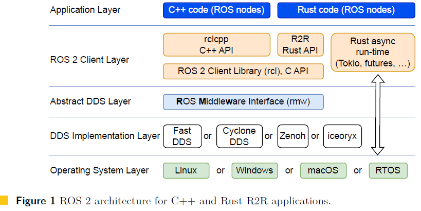
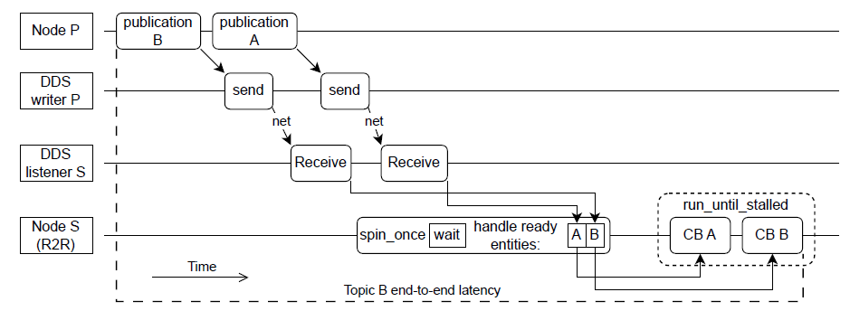
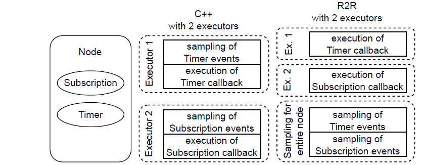
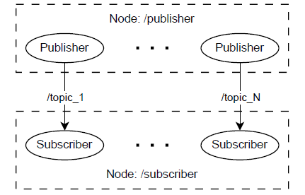
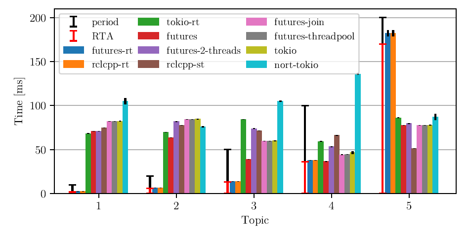
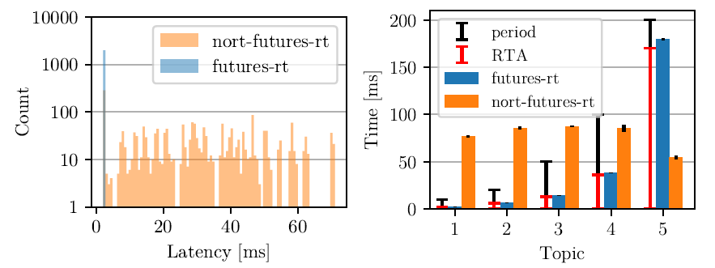
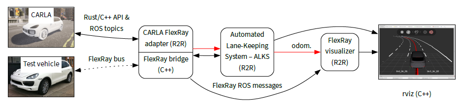
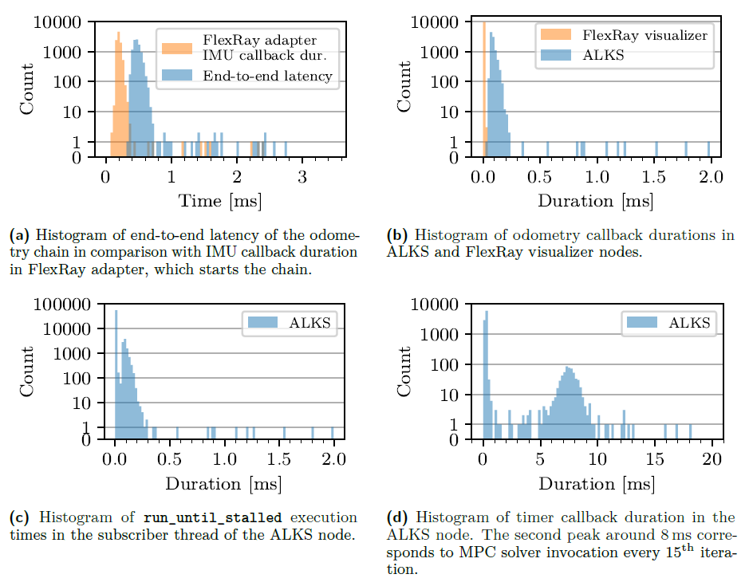

# 輪講資料：A First Look at ROS 2 Applications Written in Asynchronous Rust

**論文情報**
- 著者：Martin Škoudlil, Michal Sojka, Zdeněk Hanzálek（チェコ工科大学）
- 会議：ECRTS 2025（37th Euromicro Conference on Real-Time Systems）

---

## 1. 論文の概要

### 背景と動機

ROS 2 のリアルタイムスケジューリングや応答時間分析（RTA）は、これまでC++を前提に研究されてきた。一方で、Rustはメモリ安全性をコンパイル時に保証できる言語として人気が高まっており、ROS 2用のRustバインディング「R2R」が登場した。R2RはRustの非同期（async/await）プログラミングモデルを採用しており、実行モデルがC++版と大きく異なる。この非同期モデルでリアルタイム性を確保できるかが未解明だった。

### 貢献

1. R2Rおよび複数の非同期Rustランタイムの実行モデルを分析し、C++版と比較
2. 決定論的リアルタイム動作に適したR2Rアプリケーション構造（**futures-rt**）を提案
3. 合成ベンチマークと自動運転ケーススタディで有効性を実証

---

## 2. 前提知識



### 2.1 ROS 2の要点

ROS 2はノードベースのパブリッシュ・サブスクライブ通信フレームワークで、内部は階層構造をとる（アプリケーション → クライアントライブラリ → RMW → DDS実装 → OS）。メッセージ到着やタイマー満了などのイベントを検出する仕組みを**サンプリング**（ウェイトセットによる待機）と呼び、検出後にコールバックを実行する主体を**エグゼキュータ**と呼ぶ。

C++（rclcpp）のエグゼキュータには以下の3種類がある：

| エグゼキュータ | 特徴 |
|---|---|
| シングルスレッド | コールバックを型の優先度順に逐次実行（タイマー > サブスクリプション > サービス > クライアント） |
| マルチスレッド | 複数スレッドで並列実行。ただし飢餓問題あり |
| イベント（実験的） | ウェイトセットを使わず、DDSから直接イベントを受け取る |

- 同じ型のコールバックは登録順に実行されていたが、これはROS 2 Jazzyで変更され、**順序は予測不可能**になった。([#2532](https://github.com/ros2/rclcpp/issues/2532))
- 最近、イベントエグゼキュータのマルチスレッドバージョンが提案された

<details>
<summary>ROS 2 Jazzyの予測不可能性と議論</summary>

[#2142](https://github.com/ros2/rclcpp/pull/2142) で、エグゼキュータ内部のエンティティ管理がstd::vectorベースのAllocatorMemoryStrategyから、std::unordered_mapベースのExecutorEntitiesCollectionに変更された。
std::vectorは要素の挿入順序を保持するが、std::unordered_mapはハッシュ値に基づいて要素を格納するため、イテレーション順序がメモリアドレスに依存する。
ウェイトセットへのエンティティ追加順序がこのイテレーション順に従うようになったため、コールバックの実行順序がシステムや実行ごとに変わりうる状態になった。

開発チーム内でも意見が分かれている。alsora氏は固定順序に依存すること自体が設計上の問題であり、EventsExecutorのようにイベント発生順で処理すべきだという立場。
一方wjwwood氏は、パフォーマンスを損なわない範囲で登録順序を復元できるなら復元すべきだと考え、実際にRolling向けの修正PR [#2537](https://github.com/ros2/rclcpp/pull/2537)を提出。ただしJazzy向けにはABI互換性の制約から修正が困難とされている。

</details>

### 2.2 Rustの非同期プログラミング

Rustの非同期プログラミングは、スケジューリング決定がOS（スレッドベース並行性）ではなくアプリケーション内で行われる並行性の一形態である。

- **言語が提供するもの**：`async`/`await`キーワード、`Future`トレイト
- **外部ランタイムが提供するもの**：`Future`の実際のスケジューリングと実行

非同期タスクはOSスレッドよりはるかに軽量であり、MPSC（Multi-Producer Single-Consumer）チャネルを介して通信する。

#### MPSCチャネル（Multi-Producer Single-Consumer Channel）

複数の送信者から1つの受信者にメッセージを送るためのキュー（待ち行列）。
- **Multi-Producer**：複数のスレッド/タスクが同時にメッセージを送信できる
- **Single-Consumer**：メッセージを受け取るのは1つのスレッド/タスクだけ
```
[送信者A] ──┐
[送信者B] ──┼──→ [ キュー (FIFO) ] ──→ [受信者]
[送信者C] ──┘
```

- **同期版**：受信側はメッセージが届くまでスレッドをブロック（OS側で待機）する。
- **非同期版（本論文で使用）**：受信側はメッセージが届くまで`await`で待機する。待機中もスレッドは他の非同期タスクを実行でき、スレッドをブロックしない。

### 2.3 非同期ランタイムの比較：futures vs Tokio

この論文で評価される2つの主要な非同期ランタイムは設計思想が大きく異なる。

## futuresランタイム

futuresランタイムは実装が単純であり、決定論的なリアルタイムアプリケーションの構築に適している。
非同期タスクからOSスレッドへのマッピングを許可するが、スレッドのスケジューリングパラメータを一切制御せず、アプリケーションが適切に設定できるようにしている。

### ローカルエグゼキュータ（LocalPool v0.3.31）の動作

シングルスレッドのエグゼキュータで、以下の3つのデータ構造を持つ。

```
[受信タスクベクタ] → [アクティブタスクリスト（連結リスト）] → [レディキュー (FIFO　並行連結リスト)]
```

**動作の流れ：**

1. `spawn`されたfutureは新しい非同期タスクとしてヒープに割り当てられ、**受信タスクベクタ**に追加される
2. エグゼキュータが受信ベクタを繰り返しチェックし、タスクを**アクティブタスクリスト**に移動する（ここでメモリ割り当てが発生）
3. アクティブリストに移動された直後に、そのタスクはレディキューにエンキューされる（初回のpollを実行するため、またはawaitの待機をセットアップするため）
4. エグゼキュータはレディキューの先頭からタスクを取り出してFuture::pollを呼ぶ
5. pollの結果、タスクが完了していなければ待機状態(Pending)になる。後でreadyになったタスクはレディキューの末尾に追加される

- pollは呼ばれるたびに2つの結果のどちらかを返す。Poll::Ready(value)は計算が完了して値が得られたことを意味し、Poll::Pendingはまだ完了しておらず後で再度呼んでほしいということを意味する。

**リアルタイム観点での重要な性質：**

- レディキューは**FIFO順**で処理されるため、実行順序が予測可能
- 各タスクはレディキュー内に同時に1つしか存在できない（重複なし）
- 初期化時（`run_until_stalled`の最初の呼び出し）にメモリ割り当てが集中するため、ループ内でのメモリ割り当てを回避できる

### スレッドプールエグゼキュータ（ThreadPool　v0.3.31）の動作

複数のワーカースレッドでタスクを並列実行するエグゼキュータ。
ローカルエグゼキュータより構造が単純で、**レディキューのみ**をデータ構造として使用する（標準ライブラリの非有界同期MPSCチャネルで実装）。

**動作の流れ：**

1. 待機中のタスクがwakeされると、レディキューの**末尾に追加**される
2. 複数のワーカースレッドが**相互排他的に**レディキューからFIFO順でタスクをデキューして実行
3. キューが空ならスレッドは待機する

**ローカルエグゼキュータとの決定的な違い：**

実行中のタスクが（待機を挟まずに）再びreadyになった場合の挙動が異なる。
ローカルエグゼキュータではレディキューの末尾に戻されるが、スレッドプールエグゼキュータでは**レディキューに戻さず即座に続行**する。

**飢餓問題の例：**

N個のワーカースレッドを持つスレッドプールで、実行中に常にreadyになるN個のタスクが存在する場合、それらのタスクはレディキューに戻されることなく永遠に実行され続ける。結果として、他のタスクはまったく実行されない。

```
ワーカー1: [タスクA 実行→ready→実行→ready→実行→...]  ← 永遠にAを実行
ワーカー2: [タスクB 実行→ready→実行→ready→実行→...]  ← 永遠にBを実行
レディキュー: [タスクC, タスクD, ...]                    ← 永遠に実行されない
```

### futuresのグループ化実行（join!マクロ）

`futures::join!()`マクロで複数のfutureをグループ化すると、エグゼキュータからは**1つのタスク**として扱われる。

- グループ内のいずれか1つのfutureがreadyになると、**グループ全体がready**になる
- グループの実行が始まると、グループ内の**全readyタスクをpoll**する
- グループ内のfutureは**並列には実行されない**（同一タスクとして逐次処理）

これにより、コールバックの実行順序がグループの起動タイミングに依存して変化しうる。そのため、リアルタイムには向かない。

**例：A, C, Eをjoinでグループ化、B, Dは独立タスクの場合**

| 状況 | readyエンティティ | レディキューの状態 |
|---|---|---|
| Aが最初にready → グループ起動 | A B C D E | ← [A,C,E] [B] [D] ← |
| Aはreadyでない → Cでグループ起動 | B C D E | ← [B] [C,E] [D] ← |

グループ化されたタスクは [ ] で囲んで表記。グループ内はまとめてpollされる。グループ内でreadyでないfutureは、pollされてもPoll::Pendingを返すだけでスキップされる。

---

## Tokioランタイム

Tokioは人気のあるマルチスレッドランタイムだが、**時間の決定論性よりもスループットの最大化**を目的として設計されている。ように思われる。
スケジューリングポリシーは複雑で、抽象化レイヤーの使用により理解が困難。

### スケジューリングの仕組み

各ワーカースレッドは以下の3段階でタスクをデキューする：

```
[1] LIFOスロット → [2] ローカルレディキュー → [3] グローバル（共有）レディキュー
                                                    ↓ すべて空なら
                                              [4] ワークスティーリング
```

**1. LIFOスロット（最優先）：** 各ワーカーに1つ。最大3回連続で使用される。直前に実行したタスクを再実行しやすくすることで、CPUキャッシュの局所性を改善する意図がある。3回の制限は飢餓の軽減のため。

**2. ローカルレディキュー：** 各ワーカーに1つ。最大256タスクを保持できる。

**3. グローバル（共有）レディキュー：** 全ワーカーで共有。ローカルキューが空のときに参照される。

**4. ワークスティーリング：** ローカルもグローバルも空の場合、**他のワーカーのローカルキューからタスクの半分を盗む**。盗む対象は、ランダムな開始位置からワーカーを走査して最初に見つかった空でないキューのワーカー。

### リアルタイム観点での問題点

| 特性 | リアルタイムへの影響 |
|---|---|
| LIFOスロット | 後から来たタスクが先に実行される → 優先度逆転的な振る舞い |
| ワークスティーリング | どのスレッドがどのタスクを実行するか予測不能 |
| ランダム開始の走査 | 実行順序に非決定性が入る |
| 複雑な多段キュー | 最悪応答時間の分析が極めて困難 |

これらの特性はすべて**スループット最適化のための設計**であり、リアルタイムアプリケーションには明らかに不適切。論文の実験（第4章）でもTokioベースのバリアントはデッドライン違反を起こしている。

---

本論文の提案手法（futures-rt）では、futuresローカルエグゼキュータを各コールバック専用のスレッドで使用する。FIFO順序の予測可能性と、スケジューリングパラメータへの非干渉という2つの性質が、古典的な応答時間分析の直接適用を可能にしている。

### 2.4 rclcpp・R2R・rclrs 機能比較

#### 3ライブラリの位置づけ

| | rclcpp | R2R | rclrs |
|---|---|---|---|
| 言語 | C++ | Rust | Rust |
| 提供元 | ROS公式 | コミュニティ（Sequence Planner） | コミュニティ（ros2_rust） |
| API設計 | — | 非同期（async/await） | rclcpp類似 |

rclcppがROS公式の成熟したライブラリであるのに対し、R2RとrclrsはどちらもコミュニティサポートのRustライブラリで、一部の機能が未実装。

## 機能比較表

### 通信

| 機能 | rclcpp | R2R | rclrs |
|---|---|---|---|
| メッセージ生成 | ✅ | ✅ | ✅ |
| パブリッシャー・サブスクリプション | ✅ | ✅ | ✅ |
| Loaned messages（ゼロコピー） | ✅ | ✅ | ✅ |
| QoS設定 | ✅ | ✅ | ✅ |
| クライアント・サービス | ✅ | ✅ | ✅ |
| アクション | ✅ | ✅ | **一部のみ** |
| 動的型サポート | ✅ | ✅ | ✅ |

rclrsのアクションサポートはメッセージ型のみ利用可能で、アクションのロジックやステートマシンは自前で実装する必要がある。

### パラメータ

| 機能 | rclcpp | R2R | rclrs |
|---|---|---|---|
| パラメータ処理 | ✅ | ✅ | ✅ |
| パラメータ範囲 | ✅ | **一部のみ** | ✅ |
| パラメータロック | アプリケーション任せ | ノード単位 | パラメータ単位 |
| Derivedパラメータ（自動生成） | ❌ | ✅ | ❌ |

- **パラメータ範囲**：rqt等のGUIツールでスライダー表示するための機能。R2Rは未完全対応
- **パラメータロック**：ミドルウェアとアプリケーションの同時アクセス防止の仕組み。rclrsはパラメータごとに個別ロックのため、パラメータ数が多いとオーバーヘッド増大の可能性
- **Derivedパラメータ**：R2R独自の機能。Rustのderive macroで構造体フィールドからパラメータ処理コードを自動生成できる

### 時間管理

| 機能 | rclcpp | R2R | rclrs |
|---|---|---|---|
| タイマー | ✅ | ✅ | ❌ |
| シミュレーション時間 | ✅ | ✅ | ✅（クロックのみ） |
| トレースポイント | ✅ | ✅（本論文で追加） | ❌ |

rclrsではタイマーが未実装のため、時間ベースの処理はRust標準機能で自前実装が必要。この場合、ROSのシミュレーション時間との統合ができない。

### エグゼキュータ

| 機能 | rclcpp | R2R | rclrs |
|---|---|---|---|
| シングルスレッド | ✅ | ✅（ランタイム依存） | ✅ |
| マルチスレッド | ✅ | ✅（ランタイム依存） | ❌ |
| 非同期プログラミングスタイル | ❌ | ✅ | ❌ |

R2Rのエグゼキュータは R2R自身ではなく外部の非同期ランタイム（futures、Tokioなど）が提供する。そのため、利用可能なエグゼキュータの種類は選択するランタイムに依存する。

### その他

| 機能 | rclcpp | R2R | rclrs |
|---|---|---|---|
| コンポーザブルノード | ✅ | ❌ | ❌ |
| ライフサイクルノード | ✅ | ❌ | ❌ |

どちらのRustライブラリもコンポーザブルノード（単一プロセス内で複数ノードを実行）とライフサイクルノード（ノードの状態遷移管理）は未サポート。コンポーザブルノードの実装にはRustとC++間のABI互換性の深い調査が必要。

#### まとめ

- **rclcpp**：全機能をサポートする成熟したリファレンス実装
- **R2R**：通信機能はrclcppとほぼ同等。非同期プログラミングスタイルとderive macroによるパラメータ自動生成が独自の強み。エグゼキュータの柔軟性が高い
- **rclrs**：rclcpp類似のAPIで馴染みやすいが、タイマー未実装・アクション限定サポート・マルチスレッドエグゼキュータ非対応など機能面の制約が大きい

### 2.5 R2Rの実行モデル

R2RはRust用のROS 2クライアントライブラリであり、C++版（rclcpp）との最大の違いは**コールバック実行の管理主体**にある。

| | C++（rclcpp） | Rust（R2R） |
|---|---|---|
| サンプリング | エグゼキュータが実行 | `Node::spin_once`が実行 |
| コールバック実行 | エグゼキュータが実行 | Rust非同期ランタイムが実行 |
| イベント伝達 | 直接（サンプリング→実行が一体） | MPSCチャネル経由（分離されている） |
| コールバック優先順位 | タイマー > サブスクリプション | サブスクリプション > タイマー |

#### サンプリングの仕組み

R2Rのサンプリングは`Node::spin_once`関数によって実行される。内部動作はC++のエグゼキュータのサンプリング部分と同じ仕組みを使う。

**`spin_once`の処理手順：**

1. ノード内の全エンティティ（サブスクリプション、タイマー、クライアント、サービス）を含む**ウェイトセット**を作成する
2. 1つ以上のエンティティがreadyになるまでウェイトセット上で**ブロッキング待機**する
3. readyエンティティを順に処理する：
   - サブスクリプションの場合：`rcl_take`でRMWからメッセージを取得
   - タイマーの場合：満了イベントを取得
4. 取得したイベント（メッセージやタイマー満了）を、各エンティティに1:1で対応する**非同期MPSCチャネル**にプッシュする

**C++との違い：** readyエンティティの処理順序が異なる。C++ではタイマーが最優先（タイマー > サブスクリプション > サービス > クライアント）だが、R2Rでは**サブスクリプションが先、タイマーが後**。同じエンティティ型内では、ノード内でのエンティティ作成順に従う。

---

#### MPSCチャネルの構成

R2Rはfuturesクレートの**有界非同期チャネル**を使用し、各エンティティに1つずつ割り当てる。

```
[spin_once] ──push──→ [チャネルA (容量11)] ──await──→ [コールバックA タスク]
            ──push──→ [チャネルB (容量11)] ──await──→ [コールバックB タスク]
            ──push──→ [チャネルC (容量11)] ──await──→ [コールバックC タスク]
```

**現在の実装上の制約：**
- チャネル容量は**11イベントに固定**（設定変更不可）
- チャネルが満杯の場合、**新しいイベントはドロップ**される
- ドロップされたコールバックインスタンスは永遠に実行されない → **応答時間が非有界**になる

---

#### コールバック登録の仕組み

コールバックの登録方法もC++とは大きく異なる。

**C++の場合：** タイマーやサブスクリプションを作成するメソッドに、コールバック関数をパラメータとして直接渡す。

**R2Rの場合：** サブスクリプション作成メソッドはMPSCチャネルの**受信側**を返す。アプリケーション側で、この受信側にコールバックを結びつけた非同期タスクを作成し、エグゼキュータにspawnする。

```rust
// R2Rでのコールバック登録（Listing 1）
let subscription_future = subscription.for_each(|msg| async move {
    // コールバック処理
});
executor.spawn(subscription_future);
```

`for_each`は、チャネルからメッセージが届くたびにクロージャ（コールバック）を実行する非同期タスクを生成する。チャネルに複数メッセージが溜まっている場合、**利用可能な全メッセージに対してコールバックが連続実行**される。

#### 基本的なメインループ

futuresローカルエグゼキュータと組み合わせたR2Rの基本ループ：

```rust
// Listing 2：R2Rの基本ループ
local_executor.run_until_stalled();   // (1) 初期化
loop {
    node.spin_once(Duration::seconds(1));  // (2) サンプリング
    local_executor.run_until_stalled();    // (3) コールバック実行
}
```

**各行の役割：**

**(1) 初期化（ループ前の`run_until_stalled`）：** タスクを受信ベクタからアクティブリストに移動する。この処理にはメモリ割り当てが伴う。ループ前に一度実行することで、**ループ内でのメモリ割り当てを回避**できる。この時点ではまだ`spin_once`が呼ばれていないため、コールバックは実行されない。(サブスクリプションやタイマーの作成は全て起動時に行われる前提に基づく。R2Rの技術的制約ではなく、リアルタイムアプリケーションとしての設計方針)

**(2) サンプリング（`spin_once`）：** ウェイトセットでイベントを待機し、readyエンティティのイベントをMPSCチャネルにプッシュする。これにより、対応するコールバックタスクがwakeされ、ローカルエグゼキュータのレディキューに追加される。wakeの順序は：サブスクリプション → タイマー → その他。同型内ではエンティティ作成順。

**(3) コールバック実行（`run_until_stalled`）：** レディキュー内のすべてのタスクをFIFO順に実行する。タスクが残っていない（stalledになった）時点で制御が返る。

---

#### 実行の時系列



1. Node PがトピックBとAにメッセージをパブリッシュ
2. DDSがネットワーク経由でメッセージを送受信
3. Node Sの`spin_once`がウェイトセットで待機→AとBがreadyと判定
4. readyエンティティを処理：A, B の順にチャネルへプッシュ（アルファベット順 = 作成順）
5. `run_until_stalled`がコールバックをFIFO順に実行：CB A → CB B

- `spin_once`は各readyエンティティにつき1メッセージしかチャネルにプッシュしない。続く`run_until_stalled`がすべてのチャネルを処理して空にする。したがって**チャネルには最大1メッセージしか溜まらず、メッセージドロップは発生しない**。
- BはAより先にパブリッシュされているが、R2Rでは**サブスクリプションの作成順（アルファベット順）で処理される**ため、Aが先に処理される。そのためBのend-to-end latencyにはCB Aの実行時間も含まれることになる。

## 実行順序が変わるケース

### ケース1：spin_onceの連続呼び出し

`run_until_stalled`を挟まずに`spin_once`を複数回呼ぶと、同一エンティティの複数メッセージがレディキューに異なる位置で入る。

**例：** エンティティB, Dが1回目のサンプリングでready、A, B, Cが2回目でready。

| spin_once | readyエンティティ | レディキュー | 実行順序 |
|---|---|---|---|
| 1回目 | B, D | ← [B] [D] ← | — |
| 2回目 | A, B, C | ← [B] [D] [A] [C] ← | B₁, B₂, D, A, C |

Bは2回サンプリングされるが、1回目のspin_onceでwakeされた時点でレディキューに入っている。2回目のspin_onceでBのチャネルに2つ目のメッセージが入ると、コールバック実行時にB₁処理後にチャネルからB₂も連続して処理される。結果として**Bが2回連続実行され、Dより先に2回分が完了する**。

### ケース2：join!マクロによるグループ化

`futures::join!`でグループ化されたfutureは1つのタスクとして扱われるため、グループ内のどのfutureが最初にreadyになるかによって実行順序が変わる。

**例：** A, C, Eをjoinでグループ化、B, Dは独立。

| 状況 | readyエンティティ | レディキュー |
|---|---|---|
| Aが最初にready → グループ全体がwake | A B C D E | ← [A,C,E] [B] [D] ← |
| Aはready**でない** → Cでグループwake | B C D E | ← [B] [C,E] [D] ← |

バリアント1ではグループ（A,C,E）がBより先に実行されるが、バリアント2ではBがグループより先に実行される。

---

### 2.6 C++とR2Rの対応関係



R2Rはエグゼキュータ内でイベントをサンプリングしない。なぜなら、ウェイトセットでの待機は同期的なブロッキング操作であり、非同期タスクから実行すべきではないからである。

しかし、R2Rの柔軟な構成により、C++の各種エグゼキュータ構成を模倣できる：

R2Rのシングルスレッドエグゼキュータ模倣（futuresローカルエグゼキュータ使用時）：

```rust
初期化: run_until_stalled()   // メモリ事前割り当て
ループ:
  spin_once()               // サンプリング → チャネルにプッシュ
  run_until_stalled()       // コールバック実行（FIFO順）
```

R2Rのマルチスレッドエグゼキュータ模倣（futuresローカルエグゼキュータ使用時）：

```rust
サンプリング専用スレッド:
  loop {
    node.spin_once(Duration::seconds(1));
  }

コールバック実行スレッド:
  local_executor.run()   // 全コールバックを実行し続ける
```

| C++の構成 | R2Rでの実現方法 |
|---|---|
| シングルスレッドエグゼキュータ | `spin_once` + `run_until_stalled` を同一スレッドで交互実行 |
| マルチスレッド（相互排他グループ） | サンプリング専用スレッド + futuresローカルエグゼキュータの別スレッド |
| マルチスレッド（各コールバック独立） | サンプリング専用スレッド + futuresスレッドプールまたはTokio |
| リエントラントグループ | コールバック内で動的にタスクをマルチスレッドエグゼキュータにspawn |

- サブスクリプションとタイマーのコールバックの優先度が入れ替わるという小さな違いがある。
---

## 3. 提案手法：futures-rt構造

### 設計ルール

提案手法は2つのルールに集約される：

> **ルール1**：メインスレッドは**最高優先度**で実行し、イベントサンプリング（`spin_once`ループ）に専念する。
>
> **ルール2**：各コールバックは**低優先度の個別スレッド**で、それぞれfuturesローカルエグゼキュータにより実行する。

すべてのスレッドはLinuxの`SCHED_FIFO`スケジューラで動作させる。

### 設計の狙い

**メインスレッドを最高優先度にする理由**：
1. ROS初期化時に生成されるRMW/DDSスレッドが同じ優先度を継承し、コールバック実行に遅延されない
2. イベント発生後ほぼ即座にサンプリングが行われる

**コールバックを低優先度の個別スレッドで実行する理由**：
- ROS固有の事項を考慮する必要がなくなる
- **古典的な単一プロセッサ応答時間分析（RTA）がそのまま適用可能**になる
- レートモノトニック（RM）優先度割り当て：周期が短い → 高優先度

### 提案構造の概念図

```
[メインスレッド] 優先度: 最高（例: 21）  SCHED_FIFO
  └─ loop { node.spin_once() }   ← サンプリング専用

[RMW/DDSスレッド] 優先度: 最高（メインから継承）
  └─ 通信処理

[コールバックスレッド1] 優先度: 20  SCHED_FIFO
  └─ futures LocalPool → topic_1のコールバック（周期10ms）

[コールバックスレッド2] 優先度: 19  SCHED_FIFO
  └─ futures LocalPool → topic_2のコールバック（周期20ms）

  ... （以下同様、周期が長いほど低優先度）
```

### spawn_in_threadの構造（Listing 4より）

各コールバックスレッドは以下の手順で生成される：
```rust
fn spawn_in_thread(future: impl Future, priority: ThreadPriority) {
    let thread = ThreadBuilder::default()
        .policy(RealTime(Fifo))          // SCHED_FIFOスケジューラを指定
        .priority(priority)               // スレッド優先度を設定
        .spawn(move |_| {
            let mut local_executor = executor::LocalPool::new();  // 専用エグゼキュータ作成
            let spawner = local_executor.spawner();
            spawner.spawn_local(future).unwrap();                  // タスクを登録
            local_executor.run();                                  // 実行開始（ブロッキング）
        });
}
```

各スレッドが自分専用のローカルエグゼキュータを持つことで、コールバック間の独立性が保証される。あるコールバックの実行が別のコールバックのエグゼキュータに影響を与えることはなく、スケジューリングは完全にOSの`SCHED_FIFO`に委ねられる。

メインスレッドの構成：
```rust
fn main() -> Result<(), Box<dyn Error>> {
    // メインスレッドを最高優先度に設定
    set_thread_priority_and_policy(thread_native_id(), MAIN_PRIORITY, RealTime(Fifo));

    let ctx = r2r::Context::create()?;
    let mut node = r2r::Node::create(ctx, "example", "")?;

    // サブスクリプション作成 → コールバックを個別スレッドにspawn
    let subs = node.subscribe("/topic", QosProfile::default())?;
    let future = subs.for_each(move |msg: Msg| async move { /* 処理 */ });
    spawn_in_thread(future, CALLBACK_PRIORITY);

    // メインスレッドはサンプリングに専念
    loop {
        node.spin_once(SPIN_TIMEOUT);
    }
}
```

### 現在の制約

R2Rのチャネル容量は11イベントに固定されているため、低優先度コールバックでチャネル溢れのリスクがある。チャネル容量を設定可能にする拡張と、スケジューラビリティ分析に基づく容量設計が今後必要。

---

## 4. 実験評価

### 4.1 合成ベンチマーク

**実験設定**

| トピック # | 1 | 2 | 3 | 4 | 5 |
|---|---|---|---|---|---|
| パブリッシュ周期 [ms] | 10 | 20 | 50 | 100 | 200 |
| コールバック実行時間 [ms] | 2 | 4 | 5 | 15 | 50 |

**合成ベンチマークのROS アプリケーション構成図** 



2つのノードがあり、/publisherが5つのトピック（/topic_1から/topic_N、N=5）にメッセージを定期的にパブリッシュし、/subscriberがそれら全てを受信してコールバックを実行するという単純な構成。

各トピックのパラメータは実験設定で定義されていて、topic_1は周期10msで実行時間2ms、topic_2は周期20msで実行時間4ms、topic_3は周期50msで実行時間5ms、topic_4は周期100msで実行時間15ms、topic_5は周期200msで実行時間50ms。これらを合計するとCPU利用率が90%になるように設計されている。

CPU利用率: 90%。AMD Ryzen 7 3700U上のUbuntu 24.04、ROS Jazzy、単一隔離CPUコアで実行。

### /publisherの実装
R2RとTokioランタイムで実装。各トピックへの定期的なパブリッシュは、Linuxのtimerfdシステムコールで絶対時間タイマーを作り、それをTokioに接続して実現。各タイマーコールバックは非同期タスクとして動き、64ビット整数1つだけを含むメッセージをパブリッシュしている。

スレッド構成は、メインスレッドとRMW/DDSスレッドが優先度25、Tokioワーカースレッドが優先度24で、全てSCHED_FIFO。パブリッシャー側は評価対象ではないため、安定して正確な周期でメッセージを出せればよく、Tokioを使っても問題ない。

### /subscriberの実装

評価対象で、9つのバリアントを実装。全バリアント共通で、メインスレッドとDDSスレッドは優先度21、コールバックスレッドは優先度20から16でSCHED_FIFO、コールバックの処理時間はclock_gettimeで計測、QoSは直近100メッセージ保持に設定している。

**比較した9つのバリアント**

| バリアント名 | ランタイム | 構成の特徴 |
|---|---|---|
| **futures-rt** | futures | **提案手法**。各コールバックを個別スレッド、RM優先度 |
| futures | futures | ローカルエグゼキュータ、spin_onceと同一スレッド |
| futures-join | futures | スレッドプール、全コールバックをjoin |
| futures-thread-pool | futures | スレッドプール（2スレッド） |
| futures-2-threads | futures | サンプリング専用スレッド + 全コールバック1スレッド |
| **rclcpp-rt** | C++ | 各コールバックに専用エグゼキュータ、RM優先度 |
| rclcpp-st | C++ | デフォルトのシングルスレッドエグゼキュータ |
| tokio | Tokio | 全スレッド同一優先度 |
| tokio-rt | Tokio | spinスレッド高優先度、ワーカー低優先度 |

また、結果に表れるnort-というプレフィックスは、SCHED_FIFOではなくLinuxのデフォルトスケジューラ（SCHED_OTHER）で動かしたバリアントを意味する。

**主要な結果（：99パーセンタイルのエンドツーエンドレイテンシ）**
全バリアントを20秒間実行し、各トピックに100〜2000メッセージがパブリッシュされました。全実験を10回繰り返した結果。



1. **futures-rtとrclcpp-rtだけが全トピックのデッドラインを満たした** (デッドライン = 周期 )
2. 両バリアントの結果は理論的RTA値と一致
3. トピック5（最低優先度）のみRTA予測よりやや高いレイテンシ → サンプリング・RMW/DDSオーバーヘッドが原因
4. 他の全バリアント（futures、tokio、rclcpp-stなど）はトピック1〜3でデッドライン違反
5. nort-tokio（リアルタイムスケジューラなし）が最悪の結果

**RMW/DDSスレッド優先度の影響**
futures-rtについて、RMW/DDSスレッドに最高優先度を設定した場合としない場合を比較した。



RMW/DDSスレッドの優先度をコールバックスレッドより高く設定しないと、デッドラインを満たせないことが確認された。左側のヒストグラムを見ると、nort-futures-rtではtopic_1のレイテンシが広く分散しているのに対し、futures-rtでは狭い範囲に集中している。提案構造でメインスレッドを最高優先度にしてDDSスレッドに継承させる設計の妥当性を裏付ける結果。

### 4.2 自動運転ケーススタディ（ALKS）

**システム概要**



CARLAシミュレータ上で動作するAutomated Lane Keeping System（ALKS）。高速道路で130km/hまでの自動運転を行える。ヨーロッパで法的に認められた最初のSAEレベル3の自動運転システムである。実際のPorsche Cayenneも運転可能なシステムであるが、CARLAバージョンの方がR2Rノードが3つあり評価に適しているためCARLAシミュレータ上で評価している。

3つのR2Rノードで構成：
- **CARLA FlexRayアダプタ**：シミュレータとの通信、11トピック発行（50Hz/25Hz）
- **ALKSノード**：メイン制御ロジック（50Hz PID制御 + 300msごとのMPC（Model-Predictive Controller））
- **FlexRayビジュアライザ**：rviz向け3D可視化

**スレッド構成**

全ノードでSCHED_FIFOを使用。
ALKSノードのみがコールバックを複数スレッドで実行（サブスクライバー用とタイマー用）。

| ノード | スレッド | 優先度 | 99th WCET |
|---|---|---|---|
| FlexRayアダプタ | DDS | 20 | – |
| | spin_once ループ | 10 | – |
| | コールバック実行 | 10 | 0.3 ms |
| ALKS | DDS | 20 | – |
| | spin_once + サブスクライバCB | 10 | 0.13 ms |
| | タイマーCB | 5 | 9.8 ms |
| FlexRayビジュアライザ | DDS | 20 | – |
| | spin_once + 全CB | 10 | 0.26 ms |

**レイテンシ評価結果**



3ノードにまたがるオドメトリチェーン（FlexRayアダプタ → ALKS → ビジュアライザ）を測定：

#### Figure 10a：オドメトリチェーン全体のend-to-end latency

チェーン全体のレイテンシと、チェーンの起点であるIMUコールバックの実行時間を重ねて表示。
end-to-end latencyの分布がIMUコールバックの実行時間の分布とほぼ同じ形をしていることから、チェーン全体のレイテンシがIMUコールバック内のCARLAとのネットワーク通信遅延に支配されていることがわかる。

#### Figure 10b：チェーン中間のコールバック実行時間

ALKSノードとFlexRayビジュアライザーのオドメトリコールバックの実行時間を比較。
ALKSノードでは0.2ms程度のジッターがあるが、これはタイマーコールバックと共有データのmutex待ちが原因。FlexRayビジュアライザーではジッターが非常に小さく、シングルスレッドでmutexが不要だからである。

#### Figure 10c：ALKSノードのrun_until_stalled実行時間

ALKSノードのサブスクライバースレッドで`run_until_stalled`が呼ばれるたびの実行時間。
この1回の呼び出しでオドメトリコールバックだけでなく他のサブスクライバーコールバックも実行されるため、呼び出し回数がオドメトリコールバック単体より多くなる。その結果99パーセンタイルは0.13msで、オドメトリコールバック単体の0.16msより小さくなっている。

#### Figure 10d：ALKSノードのタイマーコールバック実行時間

別スレッドで動くタイマーコールバックの実行時間。
2つのピークがあり、左側がMPCなしの通常実行、8ms付近がMPC計算を含む実行。重要なのは、この重いタイマー処理がオドメトリチェーンのlatencyに影響していないことである。別スレッド・別優先度で動いているため、共有データの短いクリティカルセクション経由でしか干渉しない。

→ 提案構造が複数ノードにまたがる実用的アプリケーションでも決定論的動作を実現できることを実証。

---

## 5. 議論

### R2Rの利点

- サンプリングとコールバック実行を完全分離できるため、サンプル間時間をほぼゼロにできる
- コールバックのスケジューラビリティ分析がROSサンプリングから独立
- 非同期スタイルにより、複数トピックのデータ統合でステートマシンの自動構築が可能
- ROS以外のイベントソース（サードパーティライブラリ）との統合が容易
- epoll/io_uringなどの効率的イベント多重化が利用可能

### R2R固有の課題

- Rustのボローチェッカーにより、共有データの構造化に制約がある
  - 不適切な構造化 → ボローチェッカーエラー or 無関係スレッドのブロッキング → タイミング悪化
- チャネル容量が固定（現実装では11）→ 低優先度タスクでの溢れリスク

---

## 6. 関連研究

ROS 2のリアルタイム研究の系譜：

| 研究 | 対象 | 貢献 |
|---|---|---|
| Casini+ 2019 | メインラインROS 2 | 最初のモデル化・分析。実装修正にもつながった |
| Blaß+ 2021 | C++シングルスレッドエグゼキュータ | 飢餓回避を利用した応答時間分析 |
| Choi+ 2021 | カスタムエグゼキュータ | PiCAS：優先度駆動チェーン対応スケジューリング |
| Jiang+ 2022 | マルチスレッドエグゼキュータ | 処理チェーンのスケジューリング分析 |
| Teper+ 2024 | マルチスレッドエグゼキュータ | 飢餓問題の発見と修正提案 |
| Kronauer+ 2021, Sciangula+ 2023 | DDSミドルウェア | 通信レイテンシの実験的・分析的評価 |

**これらはすべてC++を対象**としており、Rustの非同期プログラミングを扱った研究は本論文が初。

---

## 7. 結論と今後の課題

### 結論

- R2Rの実行モデルは柔軟だが、デフォルト構成ではリアルタイム性を保証できない
- 提案する**futures-rt構造**（サンプリング・DDS高優先度化 + コールバックの低優先度個別スレッド実行）が全評価バリアント中で最良
- C++のrclcpp-rtと同等の性能を達成し、理論的RTA値とも一致
- 自動運転アプリケーション（ALKS）で複数ノードにまたがる決定論的動作を実証

### 今後の課題

- R2Rのチャネル容量を設定可能にする拡張
- サンプリング・RMW/DDSオーバーヘッドのより詳細なモデリング
- R2Rアプリケーション専用の応答時間分析手法の開発

---