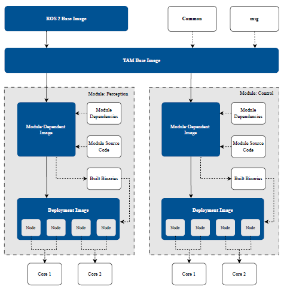
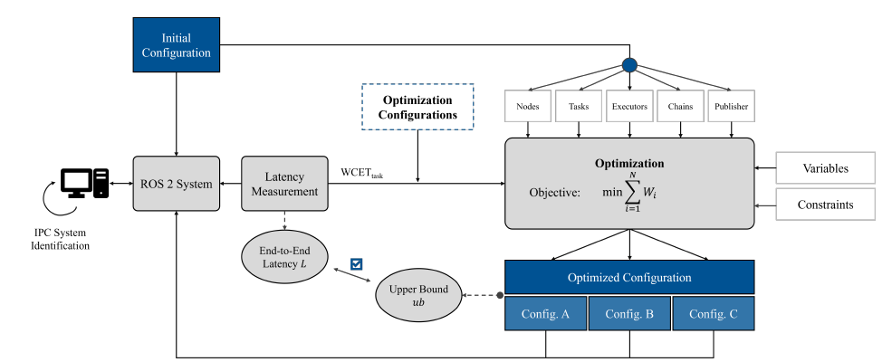
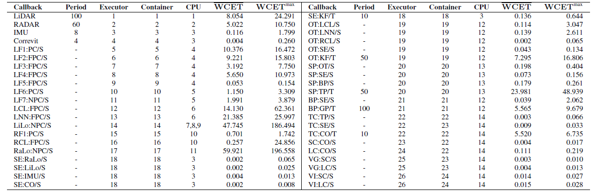
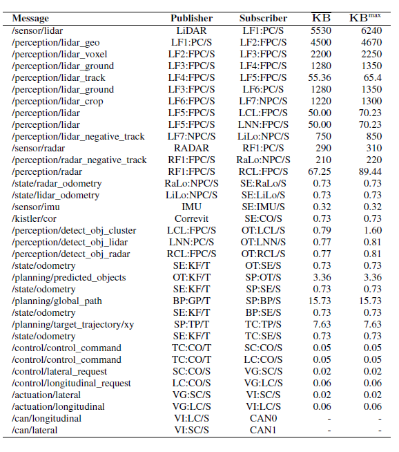
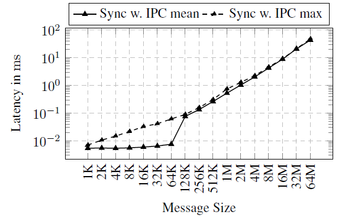
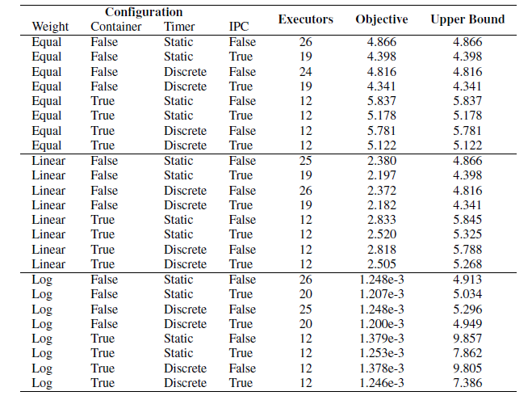
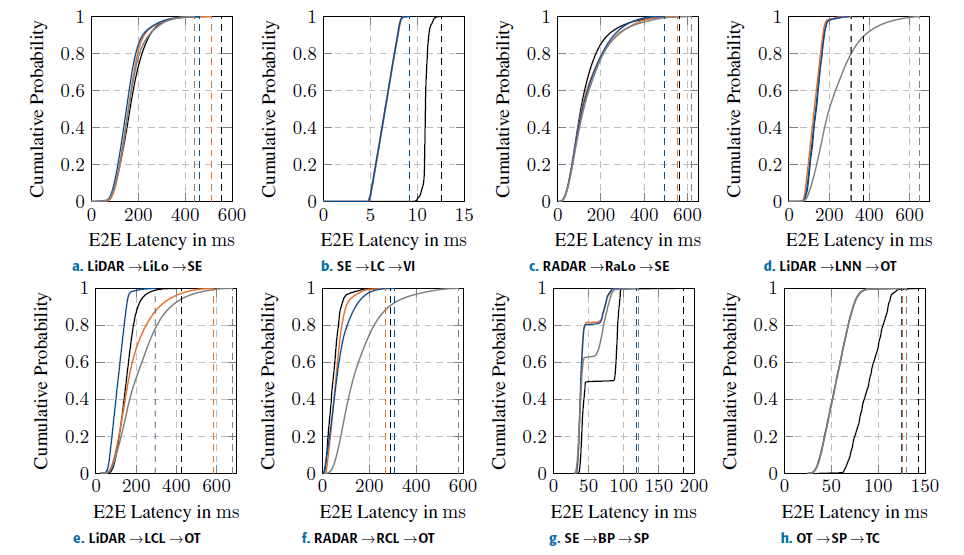
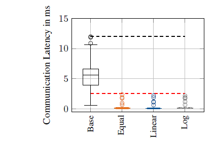
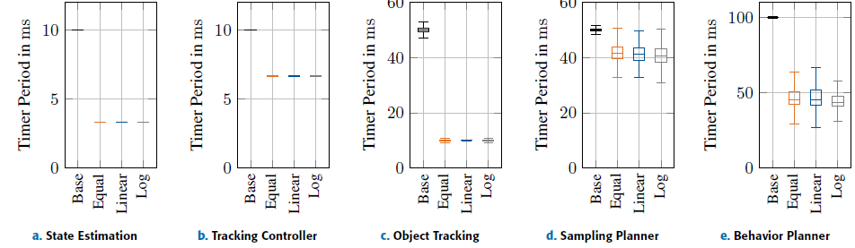

# 輪講まとめ: End-to-End Latency Optimization for Containerized ROS 2 Autonomous Driving Software

**著者:** Tobias Betz, Harun Teper, Dominic Ebner, Maximilian Leitenstern, Simon Sagmeister, Marcel Weinmann, Jian-Jia Chen, Markus Lienkamp  
**所属:** Technical University of Munich (TUM) / Technical University of Dortmund  
**掲載:** IEEE Access, 2025 (DOI: 10.1109/ACCESS.2025.3582868)

---

## 1. 研究の背景と動機

自律走行システムの複雑化に伴い、ソフトウェアのマイクロサービス化・コンテナ化が進んでいる。特に自律レーシングでは、車両が250 km/h以上で走行するため、センサ入力からアクチュエータ出力までの**エンドツーエンド（E2E）レイテンシの最小化**が安全性・制御性能に直結する。しかし、コンテナ化されたROS 2システムに対する体系的なレイテンシ最適化手法は不足していた。

---

## 2. 主要な貢献

1. **コンテナへのプロセス最適割当**問題の定式化
2. **IPC（プロセス内通信）**の統合によるレイテンシ低減の考慮
3. **複数のCause-effect chain（cause-effect chain）に対する重み付け優先度**の評価
4. 自律レースカー向け**マイクロサービスベースのデプロイ戦略**の提示
5. 実世界の高速自律レーシング用ROS 2ソフトウェアスタックでの実証評価

---

## 3. ROS 2アーキテクチャの基礎

### 3.1 主要コンポーネント

- **ノード（Node）:** システムの基本構成単位（例: 計画、制御、センサ処理）
- **タスク:** タイマー（周期的）とサブスクリプション（イベント駆動）の2種類
- **コールバック:** タスクがスケジュールされた際に実行される関数
- **通信:** DDS（Data Distribution Service）に基づくpublish-subscribeモデル

### 3.2 エグゼキュータのスケジューリング

- シングルスレッドエグゼキュータに焦点
- **ポーリングポイント（polling point）** と **処理ウィンドウ（processing window）** の2フェーズ設計
- タイマーコールバックがサブスクリプションコールバックより優先（デフォルト）
- コールバックの登録順序も実行優先度に影響

### 3.3 通信方式

| 通信方式 | 特徴 |
|---------|------|
| **DDS通信** | プロセス間通信。シリアライズ/デシリアライズのオーバーヘッドあり |
| **IPC（プロセス内通信）** | 同一プロセス内で共有メモリを使用。DDSミドルウェアをバイパスし高効率 |

本論文の最適化では、ノードを同一コンテナに集約する際のスケジューリング干渉と、分離する際のDDS通信コストのトレードオフを考慮する。なお、本研究では送信スレッドがデータ送信完了までブロックされる同期通信に焦点を当てている。

---

## 4. マイクロサービスコンテナアーキテクチャ

ROS 2システムではマイクロサービスベースのアーキテクチャへの移行が進んでおり、その理由はスケーラビリティ、モジュール性、開発速度の向上にある。このアプローチでは、異なるソフトウェア機能を個別のコンテナに分離する。

### ビルドプロセス

TAM(TUM Autonomous Motorspor)チームのマイクロサービスアーキテクチャにおけるビルドプロセスは4段階の階層構造を取る：

1. ROS 2ベースイメージ: 公開されているROS 2の公式イメージからスタート
2. TAMベースイメージ: ROS 2ベースイメージに、全下流マイクロサービスで共通に必要なメッセージ定義と共通ライブラリを追加したもの
3. モジュール依存イメージ: TAMベースイメージに特定のマイクロサービス固有の依存関係を追加。この時点ではまだマイクロサービス自体のソースコードは含まれない
4. デプロイメントイメージ: モジュール依存イメージを使い、bind mountでモジュールのソースコードをローカルビルドした後、生成されたバイナリのみを含む最終イメージを作成

この階層的アプローチの重要な利点は、コンテナのダウンロードサイズを大幅に削減できることである。TAMベースイメージやモジュールの依存関係は長期間変更されないため、Dockerの階層的レイヤー構造を活用し、OTA（Over-the-Air）アップデート時にはマイクロサービスのバイナリを含む最終レイヤーのみをダウンロードすればよい。

全コンテナのビルド後、コンピュートユニット上への配置とスケジューリングが必要となる。ここが本論文の最適化が関わる部分である。著者らはこれらのコンポーネントをコンテナへ最適に割り当て、レイテンシを最小化する手法を提案している。

---

## 5. エンドツーエンドレイテンシの定式化

システム内のデータ伝搬レイテンシを評価するため、**cause-effect chain**を導入する。

### Cause-effect chain

$$E_i = \{\tau_1, \tau_2, \ldots, \tau_{|E_i|}\}$$

タイマーから始まり、サブスクリプションが連続するタスクの列。E2Eレイテンシは各タスクのレイテンシの総和：

$$L_i = \sum_{j=1}^{|E_i|} L(\tau_j)$$

### 各タスクのレイテンシ上界

Teper et al.の手法に基づき2つの要素で構成。

- **$ub_j^{pre}$**（スケジューリングレイテンシ）: データ到着から実行開始までの時間上界。以下の3つの要因が影響する
  - タイマー周期: タイマータスクが起動されるまでのアイドル時間を決定する。周期を最適化することで実行頻度は改善できるが、他タスクによる最大遅延には影響しない
  - タスク優先度: エグゼキュータがタイマーとサブスクリプションのどちらを優先するか、また同一タイプ内でのコールバック登録順序が優先度に影響し、干渉タスクによる遅延を左右する
  - タスク干渉: 同一エグゼキュータに割り当てられたタスク同士が互いに干渉する。理想的には全ノードを個別エグゼキュータに配置すれば干渉は最小化できるが、各エグゼキュータは別プロセスとなるためコンテナ化のスケジューリングコストも考慮が必要であり、これが最適化問題に組み込まれる
- **$ub_j^{exe}$**（実行レイテンシ）: 実行開始から完了までの時間上界（通信含む）
  - 本研究ではタスクの計算時間はシステム構成に依存しない固定値と仮定し、通信レイテンシの最適化に焦点を当てる。

Macenski et al. [38] が示したように、IPCはDDS通信と比較して通信レイテンシを大幅に削減できる。最適化ではノードのエグゼキュータ割当とエグゼキュータのプロセス割当を決定し、同一プロセス内のノード間はIPC、異なるプロセス間はDDS通信となる。全ノードを1つのエグゼキュータに集約すれば通信コストは最小化できるが、$ub_j^{pre}$（スケジューリング干渉）が増大するため、**通信コストとスケジューリング干渉のバランスを取る最適な割当**が必要となる。

---

## 6. 最適化手法

### 6.1 システムモデルとchain生成

最適化に必要な入力：
- ノード・コールバックの定義（コールバック-ノード間の対応付け含む）、タイマー周期、サブスクリプションのトピック、メッセージサイズ、ノードの言語（C++/Python）。C++とPythonのノードは混在不可で、PythonノードはIPCを利用できない（IPCはrclcppのみ対応）。
- 実測による最悪実行時間（WCET）と最悪通信レイテンシ。これらはシステム構成に依存せず、ros2_tracing等のツールで計測可能である。
- 制約条件（コア数、分離が必要なノード等）。例えばセンサドライバは入力周波数が不安定になりうるため隔離配置が必須であり、Pythonコンテナも依存関係の違いから同一コンテナ環境でのコンポジションができない。

cause-effect chainの生成は、各タイマーを起点にDDSのpublisher-subscription関係をたどり、サブスクリプションのコールバックにデータを伝搬するpublisherが含まれなくなった時点でchainが完了する。各サブスクリプションは1つのpublisherからのみメッセージを受信すると仮定している。

### 6.2 最適化パラメータ

#### (1) 重み付けスキーム（3種類）

最適化の目的関数は全chainの重み付きレイテンシの総和 $\sum_{i=1}^{N} W_i$ の最小化である。各chainには開発者が整数の優先度 $Pr(i)$ を割り当て、3種類の重み付けスキームを比較する：

| スキーム | 重み $W_i$ | 特徴 |
|---------|-----------|------|
| **Equal** | $W_i = L_i$ | 全chainを同等に扱う |
| **Linear** | $W_i = L_i / Pr(i)$ | 優先度に比例して重み付け |
| **Logarithmic** | $W_i = L_i / 10^{3 \cdot Pr(i)}$ | 高優先度のchainを極端に重視 |

追加の重み付けとして、最長パス（ノード数）や最大レイテンシに基づく方法も考えられるが、本研究では上記3種類の影響を評価する。

#### (2) コンテナ最適化

先行研究では未考慮であったコンテナスケジューリングを最適化に組み込む。モデル化にあたりいくつかの仮定を置く：

- 各コンテナをサーバとして抽象化し、各プロセスがシングルスレッドエグゼキュータを実行
- サーバは周期 $P$ とバジェット $B$ で特徴づけられ、$n$ 個のプロセスが動作する場合 $B = P/n$ とする（リソースの均等分配を仮定）
- タスク $\tau_j$ のレイテンシ $L(\tau_j)$ に対し、サーバ上での処理に要する**サービス時間** $S(\tau_j)$ をUeter et al. [66] の供給境界関数（supply bound function）で計算
- chainのE2Eレイテンシを $L_i = \sum_{j=1}^{|E_i|} S(\tau_j)$ と再定義

これにより、同一コンテナに過剰なエグゼキュータを割り当てることを防ぎつつ、コンテナスケジューリングのオーバーヘッドを上界に反映できる。

#### (3) タイマー設定

タイマー周期は2つのモードを許容する。開発者が指定した固定値を使う**静的モード**と、開発者が提示した複数の候補値から最適化が選択する**離散モード**である。

#### (4) IPC通信の近似

IPCを使用する場合の最悪通信レイテンシを正確に求めるには、IPCを利用しうる全ノード組み合わせについてコンパイル・実行・計測が必要となる。これはコンテナ環境では特にリポジトリやパッケージの大量のリビルド・再構成を伴い非現実的である。そこで本研究では、**メッセージサイズと最悪IPC通信レイテンシの関係**を事前に特定サイズのメッセージで計測しておき、その値から各publisherのIPC通信コストを外挿する近似手法を採用している。これにより全ノード組み合わせのテストが不要となり、最適化の準備プロセスが大幅に簡素化される。

### 6.C 最適化ワークフロー

全体の流れは以下の通り：

1. **システム構成の読み込み:** ノードのコードから構成情報を取得
2. **chainの生成:** システム構成に基づきCause-effect chainを決定
3. **初期計測:** IPCを無効化してDDS通信時間のみを計測し、コールバックの実行・通信レイテンシを取得。初期構成でのE2Eレイテンシをベースラインとして記録
4. **制約条件の追加:** 開発者がコア数や、他ノードとコア・エグゼキュータを共有できないノードを指定
5. **最適化問題の定式化:** システム構成、レイテンシ計測値、制約条件を入力とし、変数と制約を定式化（Appendix A参照）。目的関数は全chainの重み付きE2Eレイテンシの総和
6. **求解:** Gurobiで最適化問題を解き、新しいシステム構成を出力
7. **検証:** 新構成でE2Eレイテンシを計測し、ベースラインと比較

---

## 7. 評価

### 7.1 実験環境

- **HPC:** AMD Epyc 7313P (16コア, 3.0 GHz)、128 GB RAM、NVIDIA RTX A6000
- **OS:** Ubuntu 22.04（Preempt_RTなし）、ハイパースレッディング無効
- **ROS 2:** Humble Hawksbill + Eclipse Cyclone DDS
- **コンテナ:** Docker 26.0.0 + docker-compose 2.25.0
- **シミュレーション:** Unity環境、Yas Marina Circuit、先行車速度 50 m/s

GNSS否認環境でLiDAR/RADARオドメトリによる位置推定を検証した。各構成約10,000のE2Eパスを計測。

### 7.2 ソフトウェアスタック構成

全体で24コンテナにわたる26エグゼキュータが14コア上に分散している。
構成の詳細を見ると、LiDAR、RADAR、IMU、Correvitはセンサインターフェース/ドライバである。計算負荷の面ではLiLo（LiDARオドメトリ）とRaLo（RADARオドメトリ）が最も重く、状態推定（SE）とトラッキングコントローラ（TC）は最も実行時間が短い。

システム内のROS 2メッセージとそのpublisher・subscriber間のメッセージサイズが定義されている。知覚系のメッセージサイズは特に大きく、点群サイズの変動により高いボラティリティを示す。

IPC通信の特性を把握するため、HPC上でシステム同定を実施した。可変サイズのメッセージで通信する2つのコールバックからなるワークロードを実行し、通信レイテンシを計測した。理想的には全IPC組み合わせを計測すべきだが、6.B.4節で述べた近似手法を用いている。最適化モデルのパラメータ化にはコールバックの最悪実行時間と通信レイテンシが必要である。

### 7.3 Cause-effect chainの優先度

Cause-effect chainの優先度は以下に示されており、13本のchainを6段階に分類している。

| 優先度 | Chain | 説明 |
|-------|-------|------|
| 1 | LiDAR→{LF}→LiLo→SE | 高速走行に不可欠な位置推定 |
| 1 | SE→TC→SC→VG→VI | 横方向制御（ステアリング） |
| 1 | SE→TC→LC→VG→VI | 縦方向制御（加減速） |
| 1 | Correvit→SE | 車両の縦方向・横方向速度計測 |
| 1 | IMU→SE | 車両の加速度・角速度計測 |
| 2 | RADAR→{RF}→RaLo→SE | LiDARオドメトリを補完する冗長位置推定 |
| 3 | LiDAR→{LF}→LNN→OT | メイン物体認識（車両の向き推定可能、追跡でオブジェクト生成可） |
| 3 | OT→SP→TC | 行動予測＋経路計画＋追従制御 |
| 4 | LiDAR→{LF}→LCL→OT | 副次的物体検出（向き推定不可、追跡でオブジェクト生成可） |
| 5 | SE→OT | 自車状態推定を用いた他車予測の補助 |
| 5 | RADAR→{RF}→RCL→OT | 360°カバレッジ補助（LiDAR死角の補完、追跡でオブジェクト生成不可） |
| 6 | SE→BP→SP | グローバルパス計画（長期時間軸5 s） |
| 6 | SE→SP | 次の軌道サンプリングのための自車位置更新 |

検討対象の構成は全24通りで、重み付け（equal/linear/logarithmic）× コンテナ最適化（false/true）× タイマー（static/discrete）× IPC（false/true）の組み合わせである。

- コンテナ設定について： 全重み付けスキームにおいて、Container=falseの方が上界が明らかに小さい。これは最適化が1エグゼキュータ=1コアを仮定しているため。しかし、この方法ではエグゼキュータ数がシステムの利用可能コア数を超えるため実用不可能であり、Container=trueに設定してエグゼキュータをグループ化する必要がある。
- タイマー設定について： Equalの場合、離散タイマーの方がわずかに小さい上界を示した（4.82 s vs 4.87 s）。この傾向は線形・Logarithmic付けでも同様であった。
- IPC設定について： IPCを有効にすると明確な改善が見られ、Equal・Linearで約500 msの上界改善があった。Logarithmicではやや改善幅が小さかった。

以上を踏まえ、全重み付けスキームでコンテナ最適化あり、離散タイマー、IPC有効の構成を選択した。
タイマー周期も最適化により変更された。物体追跡は50 ms→10 ms、サンプリングプランナーは50 ms→10 ms、Behavior Plannerは100 ms→50 ms、トラッキングコントローラは10 ms→6.67 ms、状態推定は10 ms→3.33 msにそれぞれ短縮された。

### 7.4 E2Eレイテンシの改善結果

7.D節（End-to-End Latency Evaluation）は、最適化後の3構成で実測したE2Eレイテンシをベースラインと比較している。

---

### 上界の妥当性

まず全13chain・全構成において、実測最大値が理論的上界を下回ることを確認した。これにより最適化モデルの上界が妥当であることが実証された。

### 各chainの結果

- **Chain 1（LiDAR→LiLo→SE）:** 全構成でベースライン（最大553.9 ms）を上回る改善。Logarithmicが最も良い最大値（437.8 ms）を達成
- **Chain 2, 3（制御系）:** 全構成で3スキームともほぼ同一の結果（最大8.7〜9.2 ms）。ベースライン（12.6 ms）から約4 msの改善。3スキームで同じエグゼキュータ構成のため差異がほぼない
- **Chain 6（RADAR→RaLo→SE）:** Linearが最大495.9 msで最良。ベースライン（563.2 ms）に対し僅かな改善にとどまった構成もある
- **Chain 7（LiDAR→LNN→OT）:** Equalが最良（最大306.3 ms）。Logarithmicはベースライン（371.5 ms）より悪化（651.8 ms）
- **Chain 9（LiDAR→LCL→OT）:** Linearが大幅改善（最大295.8 ms vs ベースライン426.5 ms）。ただしEqualは585.9 msに悪化
- **Chain 11（RADAR→RCL→OT）:** Logarithmicが最大580.1 msでベースライン（292.1 ms）より大幅悪化。Equalが最良（267.1 ms）

### 全体の結果

全13chainの実測最大値の合計による比較：

| 重み付け | 合計 | 改善率 |
|---------|------|-------|
| ベースライン | 2.880 s | — |
| Equal | 2.598 s | 9.79%改善 |
| **Linear** | **2.233 s** | **22.47%改善** |
| Logarithmic | 3.353 s | 16.42%悪化 |

### Logarithmic付け悪化の原因

Logarithmicでは高優先度chainを極端に重視した結果、エグゼキュータ7にほぼ全ての知覚ノード（RaLo、LF5、RCL、LCL、LF4、RF1）が集中した。これにより複数の中〜低優先度chainのレイテンシが大幅に増加し、全体としてベースラインより悪化した。エグゼキュータ利用率が最適化の制約に含まれていないことが根本原因である。

### 重要な知見

全chainで常にベースラインを上回る単一の構成は存在しないが、各chainには必ずベースラインより良い構成が存在する。これは重み付けスキームと優先度設定により、最適化がchainごとに異なるトレードオフを行うためである。

### 7.5 IPC近似の検証

IPCを用いたコンポジションとしてLF1とLF2フィルタを調査対象に、IPC通信を検証した。

- 最大メッセージ 4670 kBで検証
- DDS通信: 最大11.997 ms → IPC通信: 最大約2.396 ms（近似値2.550 ms）
- **約80%の通信レイテンシ削減**を確認、近似手法の妥当性を実証

### 7.6 ジッタ分析

- **状態推定・制御:** 最適化後もタイマー周期を正確に維持（3.33 ms / 6.67 ms）
- **物体追跡:** ベースラインではBehavior Plannerの高い実行時間がタイマーをブロックするため高ジッタが発生していた。最適化後に大幅改善（10 msを安定維持）
- **サンプリングプランナー:** ベースラインでは低ばらつきで良好だったが、最適化後は目標の10 msを達成できず（平均40.59 ms）。同一エグゼキュータ上の他ノードがタイマーをブロックしていることが原因。
- **Behavior Planner:** 目標50 msは平均的に達成するが、分散が増大。

---

## 8. 議論

### 主要な成果

- equal/linear重み付けで9.79%/22.47%のE2Eレイテンシ改善を達成
- IPC近似手法は実用的かつ正確
- 上界は全chain・全構成で守られた

### 課題と限界

- **Logarithmic付け**は特定chainを過度に優先し、他のchainが悪化
- 最適化結果が必ずしもコンテナアーキテクチャの設計原則と一致しない（例: IMUと知覚を同一コンテナに配置）
- **安全性の観点:** 単一エグゼキュータ内でのノードグルーピングは、1ノードの障害がエグゼキュータ全体に波及するリスク
- エグゼキュータ利用率が考慮されていない
- 全サブスクリプション/パブリッシャーが最適化モデルに含まれていない

---

## 9. 結論と今後の展望

### 実務的推奨事項

- マイクロサービスアーキテクチャの最適化は**開発初期段階で設計**すべき
- アルゴリズムは**ROS 2コンポーネント**として直接開発し、ランタイムコンポジションを可能に
- **1エグゼキュータ・1コンテナ/コア**を目標とする

### 今後の研究方向

- **OS レベルのスケジューリングと利用率**の統合
- **遺伝的アルゴリズム**等の代替最適化手法の比較
- **決定論的 → 確率論的アプローチ**への移行（最大実行時間ではなく分布を使用）
- レイテンシ改善が走行性能に与える影響の定量的分析

---