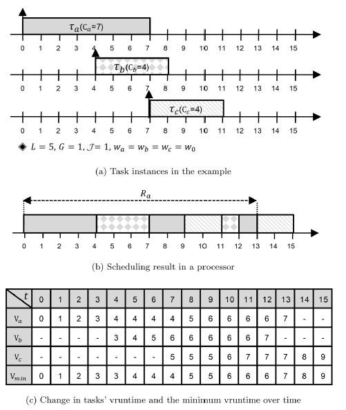
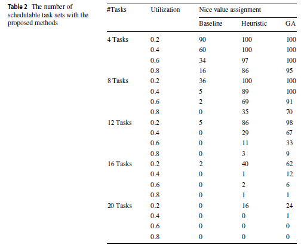
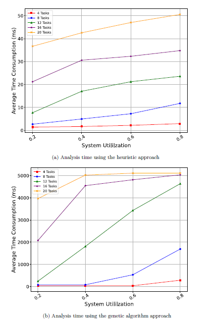
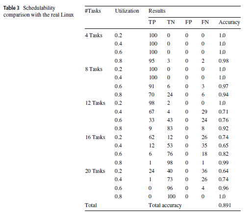
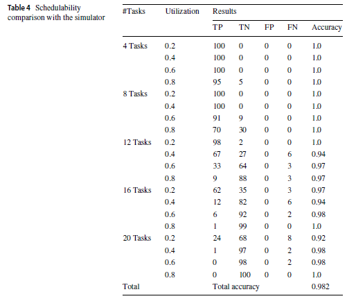
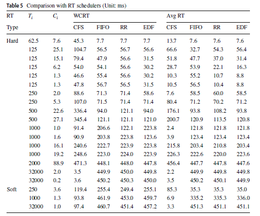
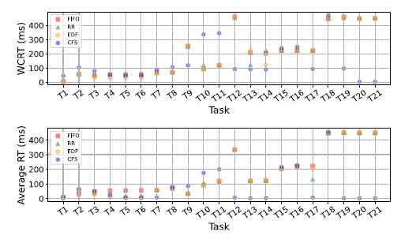
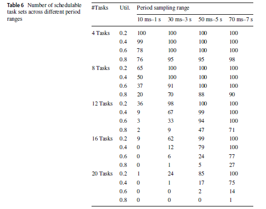

# 輪講まとめ

## Worst Case Response Time Analysis for Completely Fair Scheduling in Linux Systems

- **著者**：Kyonghwan Yoon, EunJin Jeong, Woosuk Kang, Jonghyun Choe, Soonhoi Ha（Seoul National University）
- **掲載誌**：*Real-Time Systems*, Vol. 61, pp. 118–158（2025）
- **論文**：[Springer Nature](https://link.springer.com/article/10.1007/s11241-025-09435-x)

## 0. 一言でいうと

本論文は、CFSではこれまで困難だった「各タスクが最悪でも何 ms 以内に完了するか」という計算を、CFSの特徴を利用して可能にした研究です。
また、CFSではnice値によって各タスクが受け取るCPU時間の割合が変わります。そこで本論文では、より多くのタスクがデッドラインを守れるように、各タスクへnice値を割り当てる方法も提案しています。

## 1. Introduction（なぜこの研究をするのか）

- **問題意識**：組込みシステムでも、CPU上での3D物体検出をはじめとするAI処理のように、実行時間が長く計算負荷の高いリアルタイムタスクが増えています。このようなタスクをリアルタイムスケジューラで絶対的に優先すると、低優先度タスクが長時間待たされ、システム全体の応答性や安定性が損なわれる可能性があります。

- **着眼点**：すべての実行可能なタスクへ公平にCPU時間を分配するCFSを利用すれば、リアルタイムタスクの要求を満たしながら、システム全体の応答性も維持できる可能性があります。

- **障害**：CFSでは、実行中にタスクの優先順位とタイムスライスが動的に変化します。そのため、固定された優先度を前提とする従来のWCRT解析は、そのまま適用できません。これまで、CFS上のタスクがデッドラインを守れるかを事前に判定する確立された方法はありませんでした。

- **貢献**：本論文では、CFSを対象としたWCRT解析手法を初めて提案しました。ただし、著者らはCFSがリアルタイムスケジューラより優れていると主張しているわけではありません。開発者がシステムやタスクの特徴に応じて、CFSとリアルタイムスケジューラのどちらを使うべきか判断するための材料を提供することが目的です。

## 2. CFSとは

CFS（Completely Fair Scheduler）は、Linuxで使用されてきた標準的なCPUスケジューラです。その目的は、CPUを使いたいすべてのタスクに、重みに応じて公平にCPU時間を分配することです。

CFSでは、各タスクがどれだけCPUを使ったかを`vruntime`（仮想実行時間）で管理し、基本的にvruntimeが最も小さいタスクを次に実行します。

Aを実行 → Aのvruntimeが増える
        → Bの方が小さくなる
        → 次はBを実行する

この処理を繰り返すことで、特定のタスクだけがCPUを独占することを防ぎます。

また、各タスクにはnice値に応じた重みが設定されます。

- **nice値が小さいタスク**：重みが大きく、CPU時間を多く受け取る
- **nice値が大きいタスク**：重みが小さく、CPU時間が少なくなる

重みが大きいタスクほどvruntimeがゆっくり増えるため、選ばれる回数や実行時間が多くなります。さらに、タスクが一度に実行できる時間も固定ではなく、その時点でCPUを待っているタスク数と重みによって動的に決まります。



## 3. なぜCFSでWCRT解析ができなかったのか

固定優先度方式では、対象タスクを邪魔する高優先度タスクと、最悪となるタスクの到着パターンがあらかじめ分かっています。そのため、各タスクから受ける干渉時間を計算し、WCRTを求められます。

一方、CFSでは、従来の固定優先度WCRT解析が前提とするスケジューリング上の条件が成立しません。

| 従来のWCRT解析が前提とする条件 | 固定優先度方式 | CFS |
|---|---|---|
| タスクの優先関係が実行中に変わらない | 優先度が固定されている | vruntimeに応じて実行順序が変わる |
| 対象タスクを邪魔するタスクを事前に決められる | 高優先度タスクだけが干渉する | すべての実行可能なタスクが干渉する可能性がある |
| 低優先度タスクは対象タスクの実行を妨げない | 対象タスクが実行可能なら、低優先度タスクは実行されない | 重みが小さいタスクにもCPU時間が与えられる |
| 各タスクによる干渉時間を予測できる | 高優先度タスクの実行時間と到着回数から計算できる | タイムスライスが実行可能なタスク数と重みによって変わる |
| 最悪となる到着パターンを特定できる | 高優先度タスクとの同時到着が最悪になる | 同時到着が最悪とは限らない |

そこで本論文では、最悪の実行順序を直接求めるのではなく、タスク間のvruntime差の上限から、干渉時間の上限を求める方法に切り替えています。

## 4. 解析するための条件

本論文では、次のタスクモデルとシステムモデルを前提としてWCRTを解析します。

### 4.1 タスクモデル

タスクセット $\mathcal{T}$ は、互いに独立した周期タスク（periodic task）または散発タスク（sporadic task）から構成されます。

各タスク $\tau_i$ は、次のパラメータを持ちます。

| 記号 | 意味 |
|---|---|
| $C_i$ | 最悪ケース実行時間（WCET） |
| $w_i$ | CFSで使用するタスクの重み |
| $D_i$ | ジョブがリリースされてから完了するまでの相対デッドライン |
| $T_i$ | 周期、または散発タスクの最小到着間隔 |

時間は離散時間モデルを採用し、各パラメータは正の整数とします。
また、相対デッドラインは周期または最小到着間隔以下であると仮定します。
各タスクが最初にリリースされる時刻、すなわち初期リリースオフセットは未知とします。

### 4.2 システムモデル

- 単一のCPUを持つシングルコア環境を対象とします。
- タスク間に、CPU以外の共有リソースは存在しないものとします。
- タスクは、処理の途中で自ら休止する自己サスペンド（self-suspend）を行わないものとします。
- コンテキストスイッチやスケジューリングによるオーバーヘッドは無視できるものとします。
- タスクをグループ単位で管理するgroup schedulingは使用せず、デフォルトのLinux設定を想定します。

### 4.3 スケジュール可能性の定義

解析によって求めたタスク $\tau_i$ の保守的な推定WCRTを、 $\tilde{R}_i$ と表します。

$$
\tilde{R}_i \le D_i
$$

を満たす場合、タスク $\tau_i$ はスケジュール可能（schedulable）と判定されます。すべてのタスクがこの条件を満たす場合、タスクセット $\mathcal{T}$ 全体がスケジュール可能と見なされます。

## 5. 提案手法：WCRTをどう求めるか

本論文では、従来のように最悪となるタスクの到着パターンを直接探すのではなく、CFSが管理するvruntimeを利用して、次の順番でWCRTを求めます。

1. **タスク間のvruntime差に限界があることを示す**  
 $V_{min}$と`place_entity`の性質から、あるタスクだけが極端に小さい、または大きいvruntimeを持つことはできないと示します。

2. **vruntimeの変化から、各タスクが使える最大CPU時間を求める**  
   vruntimeはCPUを使用すると増えるため、その最大増加量から、各タスクがCPUを使える最大時間を計算します。

3. **最大CPU時間を、対象タスクへの最大干渉時間とする**  
   対象タスクが完了するまでに他タスクがCPUを使った時間は、対象タスクが待たされた時間になります。

4. **すべての他タスクからの干渉を合計する**  
   同じCPU上で実行されるすべての他タスクについて、最大干渉時間を求めて合計します。

5. **対象タスクのWCRTを反復計算する**  
   「対象タスク自身の実行時間＋すべての他タスクからの干渉時間」を計算し、結果が変化しなくなるまで繰り返します。

この5段階を、以降の節で順番に説明します。なお、論文では解析の過大評価を減らすため、実際に到着できるジョブの仕事量を利用して干渉時間の上限を改善する処理も追加しています。

### 5.1 タスク間のvruntime差の限界

この解析で必要なのは、正確には、

> **干渉タスク $\tau_j$ が、対象タスク $\tau_i$ よりどれだけ小さいvruntimeから開始できるか**

という限界です。

本論文では、対象タスク $\tau_i$ のジョブがリリースされた時刻を、時刻0とします。

#### 記号の意味

| 記号 | 意味 |
|---|---|
| $V_i^0$ | 時刻0における対象タスク $\tau_i$ のvruntime |
| $V_j^0$ | 時刻0における干渉タスク $\tau_j$ のvruntime |
| $V_{min}$ | タスク全体の仮想的な進行位置を表す基準値 |
| $w_i$ | 対象タスク $\tau_i$ の重み |
| $w_0$ | nice値が0のときの基準の重み。通常は1024 |
| $L$ | CFSのtarget latency |
| $\alpha_i$ | 対象タスクが一度の実行で進める最大vruntime |

#### $V_{min}$とは

$V_{min}$は、CFSが管理する、**タスク全体の仮想的な進行位置を表す基準値**です。

$V_{min}$には、次の性質があります。

- 実行可能なタスクの最小vruntimeが進むと、 $V_{min}$も進む
- 昔の小さなvruntimeを持つタスクが復帰しても、 $V_{min}$は戻らない
- 増加または停止することはあるが、減少しない

もし $V_{min}$が昔の小さい値まで戻ると、システム全体の基準が過去に巻き戻ってしまいます。その結果、新しく来たタスクや休止から復帰したタスクが、現在動いているタスクより極端に有利になる可能性があります。

そのため、 $V_{min}$は過去に戻らず、現在の進行位置を示す基準として使用されます。

#### $L$とは

簡単にいうと、

> **CPUを待っているすべてのタスクに、およそ一度ずつ実行機会を与えるための目標時間**

です。

例えば、 $L=18$ msで同じ重みのタスクが3つなら、概ね次のようにCPU時間を分配します。

```text
18 msの一周
├─ タスクA：約6 ms
├─ タスクB：約6 ms
└─ タスクC：約6 ms
```

$L$はデッドラインや1タスクの実行時間ではなく、CFSがCPU時間を分配するための基準です。

#### 対象タスクが先へ進める最大量

CFSは、vruntimeが最も小さいタスクを選びます。

対象タスク $\tau_i$ が選ばれた時点では、そのvruntimeは $V_{min}$付近にあります。その後、1回分のタイムスライスを実行することで、vruntimeが増加します。

タスクがCPUを $\Delta_i$時間使用したとき、vruntimeの増加量は、

$$
\Delta_i\frac{w_0}{w_i}
$$

です。

一度に実行できる時間には上限があるため、vruntimeの増加量にも上限があります。この最大増加量を $\alpha_i$とします。

$$
\alpha_i=\text{一度に実行できる最大時間}\times\frac{w_0}{w_i}
$$

したがって、対象タスクは、

$$
V_i^0\le V_{min}^0+\alpha_i
$$

を満たします。式を変形すると、

$$
V_{min}^0\ge V_i^0-\alpha_i
$$

です。

つまり、対象タスクは $V_{min}$ より $\alpha_i$ 以上先へ進むことはできません。

#### `place_entity`による復帰位置の制限

`place_entity`は、新しく実行可能になったタスクをCFSの実行待ちタスク群に加えるときに、vruntimeを調整する処理です。

長く休止していたタスクは、昔の小さなvruntimeを持っている可能性があります。そのまま復帰させると、そのタスクだけが長時間選ばれる可能性があります。

そこで`place_entity`は、復帰時のvruntimeを次のように調整します。

$$
V_j^t=\max\left(V_j^{old},V_{min}^t-\frac{L}{2}\right)
$$

つまり、

- 古いvruntimeが十分大きい場合は、そのまま使用する
- 古いvruntimeが小さすぎる場合は、 $V_{min}-L/2$まで引き上げる
- vruntimeを小さくすることはない

という処理です。

そのため、干渉タスク $\tau_j$ は最低でも、

$$
V_j^0\ge V_{min}^0-\frac{L}{2}
$$

となります。

つまり、干渉タスクが $V_{min}$ より小さくなれるのは、最大でも $L/2$ までです。

#### 2つの関係を組み合わせる

対象タスクについて、

$$
V_i^0\le V_{min}^0+\alpha_i
$$

干渉タスクについて、

$$
V_j^0\ge V_{min}^0-\frac{L}{2}
$$

が成り立ちます。

最も差が大きくなるのは、次の場合です。

```text
干渉タスク τj        Vmin        対象タスク τi
      |----------------|----------------|
             L/2                αi
```

したがって、

$$
\boxed{
V_i^0-V_j^0
\le
\alpha_i+\frac{L}{2}
}
$$

となります。

これは、

> 干渉タスク $\tau_j$ が対象タスク $\tau_i$ より有利になれるvruntime差は、最大でも $\alpha_i+L/2$ まで

という意味です。

### 5.2 各タスクの最大CPU使用時間

vruntime差を求める目的は、

> **干渉タスク $\tau_j$ が、対象タスク $\tau_i$ より先にどれだけCPUを使えるかを制限するため**

です。

#### vruntimeが小さいほど有利

CFSはvruntimeが小さいタスクを選びます。

例えば、

```text
対象タスク τi：vruntime = 100
干渉タスク τj：vruntime = 85
```

なら、 $\tau_j$ の方が15小さいため、 $\tau_j$ が先にCPUを使いやすい状態です。

 $\tau_j$ がCPUを使うと、そのvruntimeが増えて $\tau_i$ に近づきます。

```text
開始時
τj = 85 ───────── τi = 100
        差は15

τjがCPUを使用
τj = 90 → 95 → 100
```

つまり、開始時の差が大きいほど、 $\tau_j$ は多くCPUを使える可能性があります。

#### 差に限界があれば、CPU使用時間にも限界を付けられる

前節では、

$$
V_i^0-V_j^0
\le
\alpha_i+\frac{L}{2}
$$

を求めました。

これは、干渉タスクが持てる開始時の有利さには限界がある、という意味です。

その後、対象タスク $\tau_i$ も完了までにCPUを $C_i$ 時間使うため、その間に自身のvruntimeが増えます。さらに、 $\tau_j$ は最後の1回のタイムスライス分だけ、 $\tau_i$ より先へ進む可能性があります。

したがって、 $\tau_j$ が増やせるvruntimeの最大量は、概念的に、

```text
開始時に持っている有利さ
＋ 対象タスクが完了までに進む量
＋ 干渉タスクの最後の1回分
```

となります。

```text
開始時のvruntime差
        ↓
τjが増やせるvruntimeの最大量
        ↓
τjが使えるCPU時間の最大値
```

vruntimeの増加量をCPU使用時間へ戻すときは、干渉タスク $\tau_j$ の重み $w_j$ を使用します。

$$
\text{ $\tau_j$ のCPU使用時間}
\le
\left(V_j^{R_i}-V_j^0\right)\frac{w_j}{w_0}
$$

ここで、 $V_j^{R_i}-V_j^0$は、対象タスクのリリースから完了までに増加した $\tau_j$ のvruntimeです。 $w_j$ は干渉タスク $\tau_j$ の重み、 $w_0$はnice値が0のときの基準の重みです。

`place_entity`によって、CPUを使用していなくてもvruntimeが引き上げられる場合があります。そのため、vruntimeの増加量から求めたCPU使用時間は、実際のCPU使用時間と等しいとは限りませんが、その値を下回ることのない安全側の上限になります。

> **まとめ**：開始時のvruntime差と、対象タスクの実行中に干渉タスクが進めるvruntimeの範囲を制限し、その増加量を重み比で実時間へ戻すことで、各干渉タスクが使えるCPU時間の上限を求めます。

### 5.3 対象タスクへの最大干渉時間

干渉時間とは、対象タスク $\tau_i$ がリリースされてから完了するまでの間に、他のタスクがCPUを使用したことで $\tau_i$ が待たされた時間です。

 $\tau_j$ から $\tau_i$ への干渉時間を、次のように表します。

$$
\mathcal{I}(\tau_j\rightarrow\tau_i,R_i)
$$

ここで、 $R_i$は対象タスク $\tau_i$ の応答時間です。

本論文はシングルコア環境を前提としています。そのため、 $\tau_j$ がCPUを使っている間、同じCPU上の $\tau_i$ は実行できません。

したがって、

$$
\text{ $\tau_j$ の最大CPU使用時間}=\text{ $\tau_i$ への最大干渉時間}
$$

として扱えます。

前節で求めたvruntime増加量によるCPU使用時間の上限を使うと、干渉時間は次のように上限付けられます。

$$
\mathcal{I}(\tau_j\rightarrow\tau_i,R_i)
\le
\left(V_j^{R_i}-V_j^0\right)\frac{w_j}{w_0}
$$

つまり、対象タスクのリリース時と完了時における干渉タスクのvruntime差が分かれば、 $\tau_j$ から受ける最大干渉時間を求められます。

> **まとめ**：シングルコアでは、干渉タスクがCPUを使用した時間だけ対象タスクが待たされます。そのため、各タスクの最大CPU使用時間を、対象タスクへの最大干渉時間として利用します。

### 5.4 実際の仕事量による上限の改善

vruntimeから求めた干渉時間は、CFSの仕組み上、干渉タスク $\tau_j$ が使用できるCPU時間の上限です。

しかし、 $\tau_j$ にそれだけの仕事が存在しなければ、その上限までCPUを使用することはできません。そのため、論文では実際に到着できるジョブの数とWCETから、仕事量の上限も求めます。

#### vruntimeによる上限だけでは大きすぎる場合

例えば、vruntimeに基づく計算では、 $\tau_j$ が対象タスクへ最大19 ms干渉できるとします。

```text
vruntimeによる最大干渉時間：19 ms
```

しかし、対象区間内に到着できる $\tau_j$ のジョブが3つで、1ジョブのWCETが2 msなら、存在する仕事量は、

$$
3\times2=6\text{ ms}
$$

だけです。

この場合、 $\tau_j$ は実際には最大でも6 msしかCPUを使用できないため、19 msの干渉は発生しません。

#### 到着できる最大ジョブ数

対象タスクの応答時間$R_i$内に到着できる $\tau_j$ の最大ジョブ数を、次のように求めます。

$$
\tilde{N}_j(R_i)=\min\left(\left\lceil\frac{R_i}{T_j}\right\rceil+1,\left\lceil\frac{\mathcal L_i}{T_j}\right\rceil\right)
$$

ここで、

- $T_j$：干渉タスク $\tau_j$ の周期、または最小到着間隔
- $\mathcal L_i$：対象タスク $\tau_i$ の応答時間を含み得る最大ビジー期間
- $+1$：対象区間の直前にリリースされ、区間内へ実行が持ち越されるジョブの分

です。

ビジー期間とは、CPUが一度もアイドルにならず、連続して仕事を処理している期間です。2つの式から求まるジョブ数のうち、小さい方を安全な上限として使用します。

#### 仕事量の上限

最大ジョブ数に、1ジョブ当たりのWCET $C_j$を掛けます。

$$
\tilde{W}_j(R_i)=\tilde{N}_j(R_i)\cdot C_j
$$

これが、対象区間内に $\tau_j$ が持ち得る仕事量の上限です。

#### 2つの上限の小さい方を採用する

最終的な最大干渉時間は、

- vruntimeから求めた干渉時間の上限
- ジョブ数とWCETから求めた仕事量の上限

の小さい方とします。

$$
\boxed{\tilde{\mathcal I}(\tau_j\rightarrow\tau_i,R_i)=\min\left(\mathcal I_{vruntime}(\tau_j\rightarrow\tau_i),\tilde{W}_j(R_i)\right)}
$$

先ほどの例では、

$$
\min(19,6)=6\text{ ms}
$$

となり、干渉時間の上限を19 msから6 msへ小さくできます。

どちらも実際の干渉時間を下回らない上限なので、その小さい方を選んでも安全性は失われません。

> **まとめ**：vruntimeに基づく上限だけでなく、実際に到着できる最大ジョブ数とWCETから仕事量の上限を求め、2つの小さい方を採用することで、安全性を保ったまま過大評価を減らします。

### 5.5 すべての干渉時間を合計する

5.4では、1つの干渉タスク $\tau_j$ が対象タスク $\tau_i$ を待たせる最大時間を求めました。

CFSでは、固定優先度方式と異なり、同じCPU上のすべての実行可能なタスクが $\tau_i$ を邪魔する可能性があります。

そこで、対象タスク以外のすべてのタスクについて最大干渉時間を求め、それらを合計します。

$$
\tilde{\mathcal I}_{total}(\tau_i,R_i)=\sum_{\tau_j\in\mathcal T\setminus\{\tau_i\}}\tilde{\mathcal I}(\tau_j\rightarrow\tau_i,R_i)
$$

記号の意味は次のとおりです。

- $\mathcal T$：タスク全体の集合
- $\mathcal T\setminus\{\tau_i\}$：対象タスク以外のすべてのタスク
- $\tilde{\mathcal I}(\tau_j\rightarrow\tau_i,R_i)$： $\tau_j$ から受ける最大干渉時間
- $\tilde{\mathcal I}_{total}$：すべてのタスクから受ける最大干渉時間の合計

#### 数値例

対象タスク $\tau_i$ が、3つのタスクから次の干渉を受けるとします。

```text
τaからの最大干渉：3 ms
τbからの最大干渉：5 ms
τcからの最大干渉：2 ms
```

合計すると、

$$
3+5+2=10\text{ ms}
$$

なので、対象タスクが待たされる時間の上限は10 msです。

```text
対象タスク自身の実行時間：7 ms
すべての最大干渉時間　　：10 ms
```

この場合、応答時間の候補は、

$$
7+10=17\text{ ms}
$$

となります。

#### なぜ単純に足してよいのか

各タスクについて求めた値は、それぞれの干渉時間を下回らないように安全側に見積もった上限です。

そのため、すべてを足せば、対象タスクが受ける総干渉時間も安全側に上限付けられます。

ただし、それぞれの最大干渉が同時に発生しない場合でもすべてを足すため、実際より大きく見積もる可能性があります。

#### 応答時間によって干渉量が変わる

干渉時間は、対象タスクの応答時間 $R_i$ によって変化します。

```text
応答時間が長くなる
        ↓
その間に到着できる他タスクのジョブが増える
        ↓
干渉時間がさらに増える
```

したがって、一度足し算するだけではWCRTを確定できません。

> **まとめ**：対象タスク以外のすべてのタスクについて最大干渉時間を求め、それらを足すことで、総干渉時間の上限を求めます。ただし、干渉時間は応答時間によって変わるため、次の段階で反復計算が必要になります。

### 5.6 対象タスクのWCRTを反復計算する

対象タスク $\tau_i$ の応答時間は、自身の実行時間と、すべての他タスクから受ける干渉時間の合計として求めます。

$$
\tilde{R}_i=C_i+\sum_{\tau_j\in\mathcal T\setminus\{\tau_i\}}\tilde{\mathcal I}(\tau_j\rightarrow\tau_i,\tilde{R}_i)
$$

ここで、

- $\tilde{R}_i$：対象タスク $\tau_i$ の保守的な推定WCRT
- $C_i$ ：対象タスク自身のWCET
- $\tilde{\mathcal I}(\tau_j\rightarrow\tau_i,\tilde{R}_i)$： $\tau_j$ から受ける最大干渉時間

です。

#### なぜ反復計算が必要なのか

求めたい $\tilde{R}_i$ が、式の左辺と右辺の干渉時間の両方に現れています。

応答時間を長く仮定すると、その間に他タスクのジョブがより多く到着できるため、干渉時間も増える可能性があります。その結果、応答時間の推定値がさらに長くなります。

```text
応答時間を仮定する
        ↓
その時間内の最大干渉を計算する
        ↓
新しい応答時間を求める
        ↓
値が変わるなら、もう一度計算する
```

#### 反復計算の手順

最初は、他タスクからまったく干渉を受けない場合を考えます。

$$
\tilde{R}_i^{(0)}=C_i
$$

その後、現在の応答時間の推定値を使って干渉時間を求め、次の値へ更新します。

$$
\tilde{R}_i^{(k+1)}=C_i+\sum_{\tau_j\in\mathcal T\setminus\{\tau_i\}}\tilde{\mathcal I}\left(\tau_j\rightarrow\tau_i,\tilde{R}_i^{(k)}\right)
$$

この計算を、次のいずれかになるまで繰り返します。

1. **値が変化しなくなった場合**  
   固定点に収束したため、その値を推定WCRT $\tilde{R}_i$とします。

2. **デッドライン $D_i$ を超えた場合**  
   この解析では、対象タスクがデッドラインを守ることを保証できないと判定します。

#### 数値例

対象タスクのWCETを、

$$
C_i=7\text{ ms}
$$

とします。

```text
0回目：R = 7 ms
       7 msの間の最大干渉を計算 → 5 ms

1回目：R = 7 + 5 = 12 ms
       12 msの間の最大干渉を計算 → 8 ms

2回目：R = 7 + 8 = 15 ms
       15 msの間の最大干渉を計算 → 8 ms

3回目：R = 7 + 8 = 15 ms
       前回と同じ値なので収束
```

したがって、

$$
\tilde{R}_i=15\text{ ms}
$$

です。

デッドラインが、

$$
D_i=20\text{ ms}
$$

なら、

$$
\tilde{R}_i\le D_i
$$

なので、対象タスクはスケジュール可能と判定できます。

一方、 $D_i=14$ msなら、推定WCRTがデッドラインを超えるため、この解析ではデッドライン達成を保証できません。ただし、これは実際に必ずデッドライン違反が発生するという意味ではなく、安全側の推定値によって保証できなかったという意味です。

#### 反復計算が終了する理由

応答時間の推定値が長くなっても、計算される最大干渉時間が小さくなることはありません。そのため、反復中の $\tilde{R}_i$ は単調に増加します。

時間は離散値として扱われるため、反復計算は、固定点に収束するか、デッドラインを超えた時点で終了します。

> **まとめ**：対象タスク自身のWCETから計算を始め、現在の推定応答時間内に発生する最大干渉を加えて更新します。値が変化しなくなるまで繰り返すことでWCRTの上限を求め、デッドラインと比較してスケジュール可能性を判定します。

## 6. nice値の割り当て

CFSでは、各タスクに設定されたnice値から重みが決まり、その重みに応じてCPU時間が分配されます。

- **nice値が小さいタスク**：重みが大きく、CPU時間を多く受け取る
- **nice値が大きいタスク**：重みが小さく、CPU時間が少なくなる

Linuxのnice値は $-20$ から $+19$ までの40段階です。nice値が1小さくなると、重みはおよそ1.25倍になります。そのため、各タスクへのnice値の割り当てによって、WCRTとスケジュール可能性が変わります。

本論文では、より多くのタスクがデッドラインを守れるように、次の2つのnice値割り当て手法を提案しています。

1. デッドラインを利用したヒューリスティック
2. 遺伝的アルゴリズムによる探索

また、提案手法と比較するため、Baselineを使用します。

> **Baseline**：すべてのタスクに同じnice値、つまり同じ重みを割り当てる方法です。タスクごとの緊急性を考慮せず、すべてのタスクへ均等にCPU時間を分配するため、「nice値を工夫しない場合」の基準になります。

### 6.1 デッドラインを利用したヒューリスティック

この方法の基本的な考え方は、

> **デッドラインが短く、早く完了する必要があるタスクほど、小さいnice値を与える**

というものです。

各タスクのnice値を、次の式で求めます。

$$
nice_i=\max\left(-20,\;19+\lambda\left\lceil\ln\frac{D_i}{D_{max}}\right\rceil\right)
$$

ここで、

- $D_i$：タスク $\tau_i$ のデッドライン
- $D_{max}$：タスクセット内で最も長いデッドライン
- $\lambda$：デッドラインの違いをnice値へどれだけ強く反映するか
- $-20$：nice値の最小値

です。

$D_i/D_{max}$は1以下になるため、デッドラインが短いほど式から求まるnice値も小さくなります。

```text
デッドラインが短い
        ↓
nice値を小さくする
        ↓
重みが大きくなる
        ↓
CPU時間を多く受け取る
        ↓
WCRTが短くなりやすい
```

#### $\lambda$の役割

$\lambda$は、タスク間のnice値の差を調整します。

- $\lambda$が小さい：nice値の差が小さく、全タスクを公平に扱う
- $\lambda$が大きい：デッドラインが短いタスクを強く優先する

ただし、 $\lambda$が大きすぎると一部のタスクへCPU時間が偏り、ほかのタスクがデッドラインを守れなくなる可能性があります。

#### 探索手順

1. 最大のデッドライン $D_{max}$ を求める
2. $\lambda$ を最小値 $\lambda_{min}$ に設定する
3. 式を使って全タスクのnice値を計算する
4. 5章のWCRT解析で、全タスクがスケジュール可能か判定する
5. スケジュール可能なら、そのnice値を採用する
6. 不可能なら、 $\lambda$ を $\lambda_{gap}$ だけ増やして再計算する
7. $\lambda_{max}$ まで試しても成功しなければ、割り当てに失敗したと判定する

$\lambda_{gap}$ は、 $\lambda$ を変化させる刻み幅です。小さくすると細かく探索できますが、WCRT解析の実行回数が増えます。

```text
λを小さな値から開始
        ↓
nice値を計算
        ↓
WCRT解析で判定
   ┌────┴────┐
成功           失敗
 ↓              ↓
採用       λを増やして再試行
```

この方法は、スケジュール可能になる最小の $\lambda$ を探します。必要以上にnice値の差を広げないことで、リアルタイム要求を満たしながら、低優先度タスクの応答性も維持します。

> **特徴**：計算が速く、割り当て理由も分かりやすい一方、デッドラインだけを基準にするため、必ずしも最良の組み合わせが得られるとは限りません。

### 6.2 遺伝的アルゴリズム

nice値は1タスクにつき40通りあります。タスク数を $n$ とすると、nice値の組み合わせは、

$$
40^n
$$

通りになるため、すべての組み合わせを試すことは現実的ではありません。

そこで、生物の進化を模倣した遺伝的アルゴリズムを使って、良いnice値の組み合わせを探索します。

#### nice値割り当てとの対応

| 遺伝的アルゴリズムの用語 | 本論文での意味 |
|---|---|
| 遺伝子 | 1つのタスクに設定するnice値 |
| 染色体 | 全タスクのnice値を並べた1つの割り当て案 |
| 個体群 | 複数のnice値割り当て案の集合 |
| 適応度 | WCRT解析でスケジュール可能と判定されたタスク数 |

例えば、4タスクのnice値を、

```text
[-10, 0, 5, 10]
```

とした場合、この4つの値をまとめたものが1本の染色体です。このnice値を使って各タスクのWCRTを計算し、デッドラインを守れたタスク数を適応度とします。

#### 探索手順

1. **初期個体群の生成**  
   nice値の組み合わせをランダムに多数作ります。

2. **適応度の計算**  
   各組み合わせについてWCRT解析を行い、スケジュール可能なタスク数を数えます。

3. **選択**  
   ルーレットホイール方式で親を2つ選びます。これは、適応度が高い候補ほど選ばれやすくしながら、ほかの候補にも選ばれる可能性を残す方法です。

4. **交叉**  
   2つの親のnice値を途中で入れ替え、新しい組み合わせを作ります。

   ```text
   親1：[-10, -5 |  5, 10]
   親2：[  0,  5 | -5,  0]
                   ↓
   子 ：[-10, -5 | -5,  0]
   ```

5. **突然変異**  
   一定の確率で一部のnice値をランダムに変更し、探索する組み合わせの多様性を維持します。

6. **置き換え**  
   新しく作った組み合わせの適応度が高ければ、個体群内の組み合わせと入れ替えます。

7. **終了判定**  
   すべてのタスクがスケジュール可能になるか、制限時間に達するまで探索を繰り返します。

8. **最良解の採用**  
   最後に、最も多くのタスクがスケジュール可能になったnice値の組み合わせを採用します。

```text
nice値の候補を多数生成
        ↓
WCRT解析で評価
        ↓
良い候補を選択
        ↓
交叉・突然変異
        ↓
より良い候補へ置き換え
        ↓
全タスク成功または時間切れ
```

> **特徴**：ヒューリスティックより広い範囲を探索でき、より良いnice値の組み合わせを見つけやすい一方、WCRT解析を多数回実行するため計算時間が長くなります。また、必ず全体で最良の組み合わせを発見できる保証はありません。

### 2手法の比較

| 方法 | 考え方 | 長所 | 短所 |
|---|---|---|---|
| Baseline | 全タスクを同じnice値にする | 最も簡単 | タスクごとの緊急性を考慮しない |
| ヒューリスティック | 短いデッドラインほど小さいnice値にする | 高速で説明しやすい | デッドライン以外の影響を十分に探索しない |
| 遺伝的アルゴリズム | 多数のnice値の組み合わせを進化的に探索する | より良い組み合わせを発見しやすい | 計算時間が長く、最適性の保証はない |

## 7. 実験

実験では、主に次の点を評価しています。

1. 提案したnice値割り当て手法によって、スケジュール可能なタスクセットが増えるか
2. 提案したWCRT解析が、安全側の結果を出しているか
3. 解析結果が実機やシミュレータの結果とどの程度一致するか
4. CFSとリアルタイムスケジューラにどのような違いがあるか
5. どのようなタスクセットにCFSが向いているか

### 7.1 実験環境

#### 合成タスクセット

さまざまな条件で提案手法を評価するため、UUniFastを使用して合成タスクセットを生成しています。UUniFastは、指定したCPU利用率を複数のタスクへ分配する、リアルタイムシステム研究で広く使用される生成方法です。

主な条件は次のとおりです。

| 項目 | 設定 |
|---|---|
| タスク数 | 4、8、12、16、20 |
| CPU利用率 | 0.2、0.4、0.6、0.8 |
| 各条件のタスクセット数 | 100 |
| 合計 | 2000タスクセット |
| タスクの周期 | 30 ms〜3 s |
| デッドライン | 周期と同じ値（ $D_i=T_i$ ） |
| 各ジョブの実行時間 | WCET $C_i$ |

各タスクセットは、周期の最小公倍数であるハイパーピリオドの2倍の時間だけ実行またはシミュレーションします。

#### 実世界のタスクセット

現実的な条件でCFSとリアルタイムスケジューラを比較するため、Thales Alenia Space（TAS）の衛星搭載ソフトウェア由来のタスクセットも使用しています。

- 全21タスク
- ハードリアルタイムタスク：18
- ソフトリアルタイムタスク：3
- CPU利用率：約74%

#### シミュレータと実機

著者らは、実行順序や初期リリース時刻が異なる状況を効率よく探索するため、イベント駆動型のCFSシミュレータを独自に作成しました。シミュレータでは、1タスクセット当たり最大1000通りの実行シナリオを探索します。

実機実験には、次の環境を使用しています。

| 項目 | 設定 |
|---|---|
| 実機 | Raspberry Pi 4（Cortex-A72） |
| OS | Raspberry Pi OS |
| Linuxカーネル | 5.15.92 |
| target latency $L$ | 18 ms |
| minimum granularity $G$ | 2.25 ms |
| jiffy $\mathcal J$ | 1 ms |
| 基準の重み $w_0$ | 1024 |

シミュレータと提案解析は、実機で測定し直したWCETを入力として使用し、比較条件をそろえています。

### 7.2 nice値割り当ての評価

次の3方式を比較しています。

1. 全タスクを同じnice値にするBaseline
2. デッドラインを利用するヒューリスティック
3. 遺伝的アルゴリズム

ヒューリスティックの設定は、

$$
\lambda_{min}=0,\qquad
\lambda_{max}=40,\qquad
\lambda_{gap}=0.1
$$

です。

遺伝的アルゴリズムでは、個体数を1000、突然変異率を5%、制限時間を5秒としています。

#### 結果



- Baselineと比べて、ヒューリスティックと遺伝的アルゴリズムはスケジュール可能なタスクセット数を大きく改善した
- 遺伝的アルゴリズムは、ヒューリスティックより多くのタスクセットをスケジュール可能にした
- ただし、遺伝的アルゴリズムは広い範囲を探索するため、計算時間が長くなった
- タスク数とCPU利用率が高い場合は、nice値を調整してもスケジュール不可能なケースが残った

nice値探索にかかった時間は、次のとおりです。



| 方法 | 計算時間 |
|---|---:|
| ヒューリスティック | 2〜50 ms |
| 遺伝的アルゴリズム | 37〜5112 ms |

> **結果**：ヒューリスティックは高速、遺伝的アルゴリズムは時間がかかる代わりに、より良いnice値割り当てを見つけやすいというトレードオフがあります。

### 7.3 WCRT解析の評価

提案したWCRT解析によるスケジュール可能性の判定を、実際のLinux環境および独自シミュレータの判定と比較しています。

ここで示される89%や98%は、WCRTの数値そのものの誤差率ではありません。2000個のタスクセットについて、スケジュール可能・不可能という判定が一致した割合です。

#### 実Linuxとの比較



実機では、各タスクセットをハイパーピリオドの2倍だけ実行し、観測された最長の応答時間を実測WCRTとして使用しました。この処理を各タスクセットについて5回繰り返しています。

提案解析と実Linuxのスケジュール可能性判定の平均一致率は、約89%でした。

ただし、実機実験で本当の最悪実行パターンが発生した保証はありません。そのため、この89%だけから解析の正確さを断定することはできません。

#### シミュレータとの比較



シミュレータは1タスクセットにつき最大1000通りの実行シナリオを探索できるため、実機より幅広い条件を確認できます。

提案解析とシミュレータの判定の平均一致率は、約98%でした。

また、シミュレータとの比較ではFalse Positiveが0でした。

> **False Positive**：解析ではスケジュール可能と判定したのに、実行結果ではデッドライン違反が発生する危険な誤判定です。

すべての実験で、提案手法が推定したWCRTは、実機またはシミュレータで観測されたWCRT以上でした。この結果は、提案手法が安全側にWCRTを見積もっていることを実験的にも示しています。

#### 過大評価が増える場合

タスク数やCPU利用率が増えると、判定の一致率は低下しました。

これは、提案手法が各タスクから受ける最大干渉を個別に求め、すべて足し合わせるためです。実際の実行では、すべての最大干渉が同時に発生するとは限りません。そのため、タスク数が増えるほどWCRTを大きく見積もりやすくなります。

```text
タスク数・CPU利用率が増える
            ↓
足し合わせる最大干渉が増える
            ↓
実際には同時発生しない干渉まで計上する
            ↓
WCRTの過大評価が増える
```

提案されたWCRT解析自体は、合成タスクセットのスケジュール可能性を数百マイクロ秒程度で推定できました。また、2000タスクセットの実行には実Linuxで約70時間かかったのに対し、シミュレータでは最大1000経路を探索しながら約2時間で完了しました。

### 7.4 CFSとリアルタイムスケジューラの比較

衛星搭載ソフトウェア由来の21タスクを使用し、CFSと次のLinuxリアルタイムスケジューラを比較しています。

- SCHED_RR
- SCHED_FIFO
- SCHED_DEADLINE

実機上でハイパーピリオドの2倍の時間だけ実行する処理を30回繰り返し、最悪応答時間、平均応答時間、スケジュール可能性を比較しました。

#### 結果




- 高優先度タスクでは、リアルタイムスケジューラの方が短い応答時間になる傾向があった
- CFSは全タスクへCPU時間を分配するため、システム全体の応答性を維持できた
- WCETが $G=2.25$ msより短いタスクは、1回のタイムスライスで完了できるため、CFSで平均応答時間が短くなる場合があった
- この実験では、CFSとリアルタイムスケジューラの両方で、すべてのハードリアルタイムタスクがデッドラインを満たした

タスクセットの特徴によって、適切なスケジューラが異なることを示しています。

### 7.5 CFSが向く場合・向かない場合

CFSは公平性を重視しており、遅延要求を直接扱う仕組みを持っていません。また、すべての実行可能なタスクが干渉する可能性があり、選ばれたタスクには最低でもminimum granularity $G$ の実行時間が与えられます。

そのため、次のような場合はCFSに向いていません。

- タスク数が多い
- CPU利用率が高い
- タスクの周期やデッドラインが短い
- デッドラインまでの余裕が小さい



周期の範囲を変えた実験では、周期が10 ms〜1 sのタスクセットは、タスク数が12を超えるとほとんどがスケジュール不可能になりました。

一方、周期が長くなるほど、タスク数やCPU利用率が高い場合でもスケジュール可能なタスクセットが増えました。

```text
短周期・高負荷・多数タスク
        → CFSは不向き

数百ms〜数秒周期の重い処理
        → CFSを利用できる可能性が高い
```

AI処理のように計算量は大きいものの、周期が数百ミリ秒から数秒程度あるタスクでは、リアルタイム要求を満たしながらシステム全体の応答性を維持できる可能性があります。

> **実験全体の結論**：提案したWCRT解析は安全側の結果を高速に求められ、nice値割り当てによってCFS上のスケジュール可能性を改善できました。ただし、CFSは短周期、高負荷、多数タスクの環境には向かず、比較的周期が長く実行時間の大きいタスクで有力な選択肢になります。
